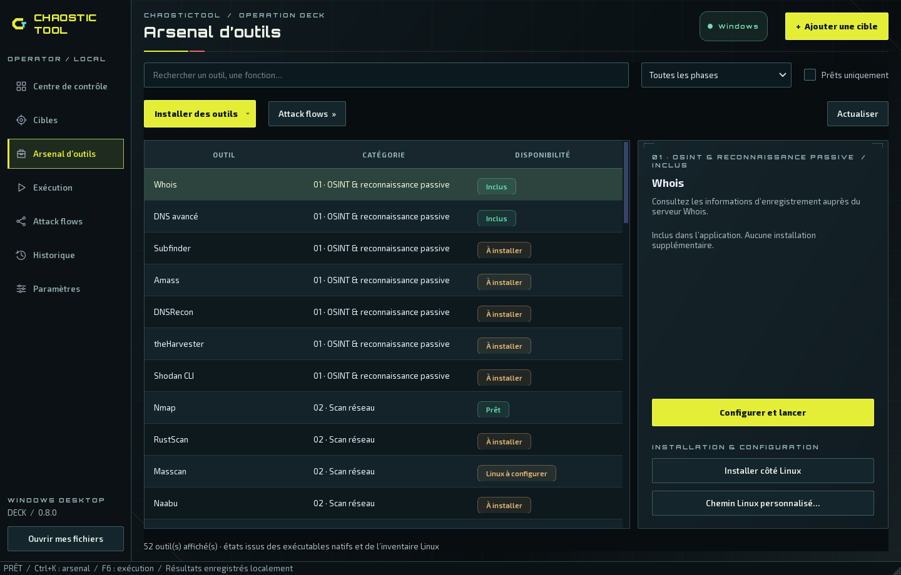
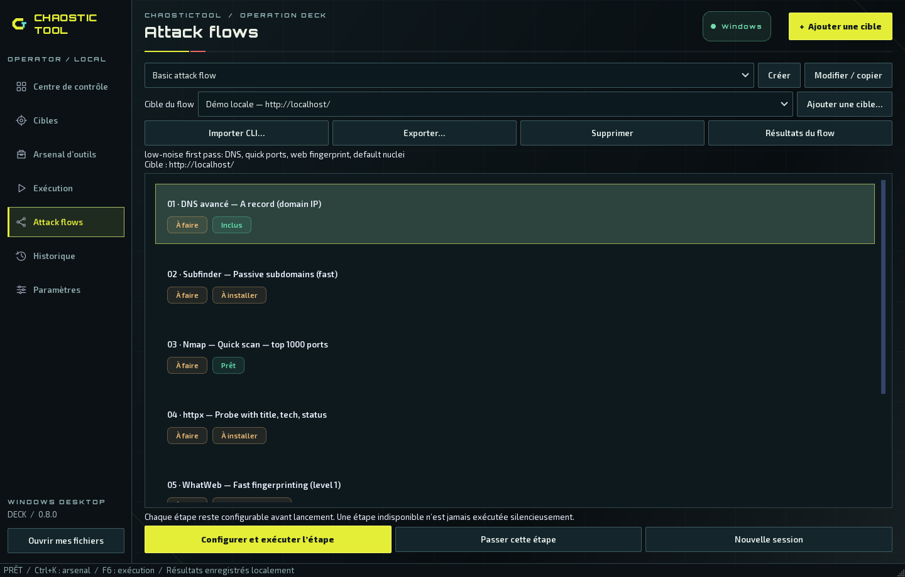
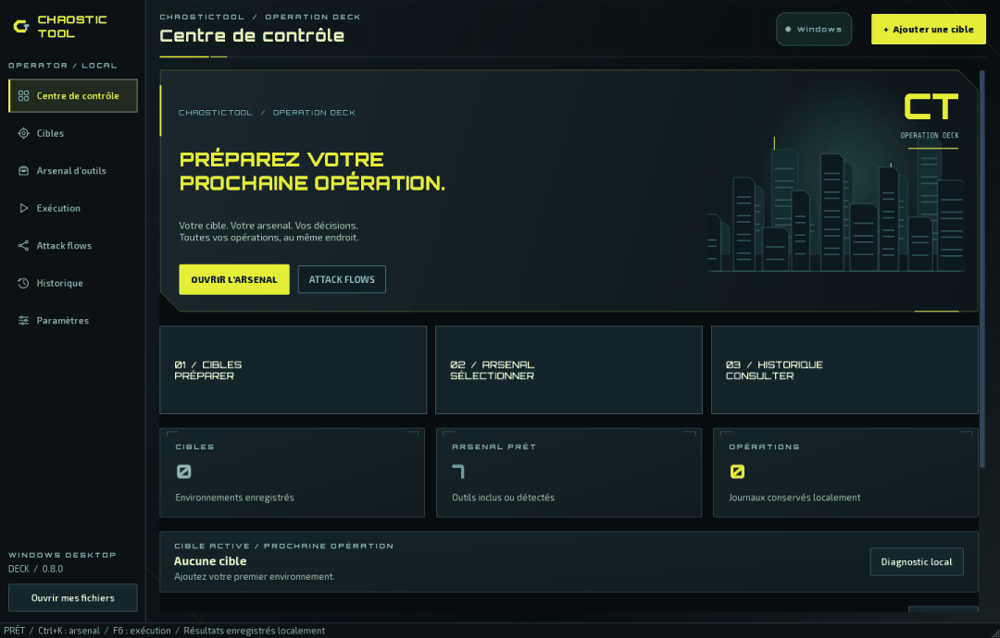

# ChaosticTool Desktop · OPERATION DECK

**Votre centre d’opérations graphique pour Windows 10 et Windows 11.**

Préparez vos cibles, choisissez vos outils par phase, configurez vos opérations et retrouvez leurs résultats dans une interface en français inspirée des menus de jeux vidéo. L’application possède son installateur et se désinstalle depuis Windows.

**[Télécharger Desktop 0.8.0](https://github.com/Chaos-Tic/Chaostic-Tool/releases/tag/desktop-v0.8.0)** · **[Guide Windows détaillé](README_WINDOWS.md)** · **[Version Linux en terminal](https://github.com/Chaos-Tic/Chaostic-Tool/tree/linux-cli)**


*Application réelle, avec un profil de démonstration isolé. Les outils disponibles dépendent du poste de capture. Les releases ne contiennent ni ce profil ni l’historique du développeur.*

## Deux éditions, un dépôt

| Édition | Usage | Documentation |
|---|---|---|
| **Desktop / Windows** | Application graphique, formulaires et résultats sans ouvrir un terminal | Branche [`desktop/windows-app`](https://github.com/Chaos-Tic/Chaostic-Tool/tree/desktop/windows-app), ce README et le [guide Windows](README_WINDOWS.md) |
| **Linux CLI** | Expérience en terminal et fonctions propres à la CLI | Branche [`linux-cli`](https://github.com/Chaos-Tic/Chaostic-Tool/tree/linux-cli), [guide CLI](README_LINUX.md) |
| **Desktop Linux / macOS** | La même interface graphique sur un autre système | [Paquets et installation multi-systèmes](docs/DESKTOP.md) |

La branche historique `main` s’appelle maintenant **`linux-cli`**. Le renommage ne fusionne pas les éditions. Les captures de ce README concernent Desktop.

## Télécharger et installer

| Votre ordinateur | Installateur | Systèmes visés |
|---|---|---|
| Intel ou AMD 64 bits | [Windows x64](https://github.com/Chaos-Tic/Chaostic-Tool/releases/download/desktop-v0.8.0/ChaosticTool-Setup-0.8.0-windows-x64.exe) | Windows 10 **1809 ou ultérieur**, Windows 11 |
| ARM64, par exemple Snapdragon | [Windows ARM64](https://github.com/Chaos-Tic/Chaostic-Tool/releases/download/desktop-v0.8.0/ChaosticTool-Setup-0.8.0-windows-arm64.exe) | Windows 11 ARM64 |

1. Vérifiez l’architecture dans **Paramètres Windows → Système → Informations système**, puis téléchargez le `.exe` correspondant. Les archives GitHub « Source code » ne sont pas l’installateur.
2. Lancez l’installation. **Python et Git ne sont pas nécessaires** pour démarrer l’application distribuée.
3. Ouvrez **ChaosticTool Desktop** depuis le menu Démarrer. **Ouvrir mes fichiers** donne accès à votre espace de données.
4. Essayez le diagnostic local, puis ajoutez une cible et installez les outils nécessaires à votre usage.

Les installateurs et leurs empreintes SHA-256 figurent dans la [release](https://github.com/Chaos-Tic/Chaostic-Tool/releases/tag/desktop-v0.8.0). Desktop reste une **préversion**, sans signature d’éditeur Windows ; Windows peut afficher un avertissement de réputation. La distribution macOS n’est pas notarisée.

### Compatibilité de l’application et des outils

L’interface est empaquetée pour les systèmes ci-dessus ; Windows 32 bits n’est pas pris en charge. Les dépendances des outils sont distinctes : certains fonctionnent nativement, d’autres demandent Linux, un service, une clé API, un pilote ou des droits particuliers. WSL 2 dépend également de la virtualisation et des politiques de la machine.

Les builds x64/ARM64 sont testés automatiquement. Cela ne valide pas chaque GPU, antivirus, adaptateur Wi-Fi et outil externe sur toutes les machines. Consultez la [matrice des outils](docs/WINDOWS_PORT.md) pour les limites fonctionnelles.

## Votre première opération

1. **Cibles → Ajouter une cible** : indiquez un domaine, une IPv4/IPv6 ou une URL et un nom reconnaissable. L’ajout seul ne lance aucune connexion.
2. **Arsenal d’outils** : cherchez un outil ou sélectionnez sa phase. Son état indique s’il est disponible ou demande une préparation.
3. **Configurer et exécuter** : vérifiez la cible, le moteur et le profil. Les champs dépendent de l’outil.
4. **Exécution** : suivez la sortie et l’état. **Arrêter** interrompt l’opération ; le journal partiel reste disponible.
5. **Historique** : retrouvez le résultat, sa cible, sa date et son état, puis ouvrez les fichiers produits.

Pour découvrir l’interface sans scan distant, utilisez **Diagnostic local** ou une résolution de `localhost`. Utilisez les outils et les flows dans le cadre de vos autorisations.

## Les sept espaces de travail

| Écran | Fonction |
|---|---|
| **Centre de contrôle** | Cible active, outils inclus/détectés, opérations conservées et raccourcis |
| **Cibles** | Ajout, nommage et sélection des environnements |
| **Arsenal d’outils** | Recherche, classement par phase, installations compatibles et profils |
| **Exécution** | Configuration, sorties, saisie des sessions interactives et arrêt |
| **Attack flows** | Cible propre au flow et suite d’étapes guidées |
| **Historique** | Filtres combinables, consultation et suppression des résultats |
| **Paramètres** | Linux/WSL/SSH, animations, chemins de données et détection des outils |

**Raccourcis :** `Ctrl+K` ouvre la recherche de l’arsenal ; `F6` ouvre l’exécution. Les commandes restent accessibles au clavier.

## Catalogue : 48 outils CLI et 4 diagnostics supplémentaires



Desktop reprend les **48 outils d’origine**, avec leurs profils graphiques, et ajoute **4 diagnostics**. Le classement par phases reprend celui de la CLI. Les options sont présentées dans des formulaires.

**Une entrée dans le catalogue ne signifie pas que son programme est installé.** Les états distinguent les fonctions intégrées, les exécutables détectés et les dépendances manquantes. Un pack natif et des installations individuelles sont proposés lorsque le programme peut être géré sur votre plateforme.

| Moteur | Utilisation | Préparation |
|---|---|---|
| **Natif** | Fonctions intégrées et outils compatibles avec le système hôte | Aucune pour les fonctions intégrées ; installation ou chemin d’exécutable pour les autres |
| **WSL** | Outils Linux sous Windows, dont Nmap/RustScan via l’environnement configuré | WSL, distribution et dépendances Linux |
| **Linux local** | Desktop lancé sous Linux | Outils installés sur ce système |
| **SSH** | Votre machine Linux ou VM distante | Accès SSH et outils sur cette machine |

Les archives portables gérées sont vérifiées par SHA-256 ; les outils Python gérés utilisent des environnements isolés. Certaines fonctions dépendent de services ou de matériel spécifique. **Tor/proxychains et VPN guard** restent propres à l’édition CLI.

## Préparer WSL et Kali Linux

Dans **Paramètres → Installer WSL et Kali Linux…**, Desktop détecte l’environnement, propose la préparation de WSL/Kali et configure les composants Linux qu’il gère. L’activation des fonctionnalités Windows peut demander une élévation administrateur.

**Si Windows demande un redémarrage, redémarrez le PC avant de reprendre.** Un téléchargement terminé ne signifie pas que la distribution est utilisable. Desktop conserve l’étape de préparation et distingue le redémarrage requis d’un environnement prêt. La préparation inachevée peut être reprise au lancement suivant.

Le compte Linux dédié `chaostic-tool` sert aux opérations ordinaires. Les profils demandant explicitement des privilèges sont traités séparément. Votre distribution WSL par défaut n’est pas remplacée.

WSL n’est pas nécessaire pour ouvrir Desktop ou utiliser les fonctions natives. Il ne donne pas automatiquement accès aux fonctions Wi-Fi bas niveau : interfaces, pilotes et matériel doivent être disponibles dans l’environnement choisi. [Préparation et dépannage détaillés](README_WINDOWS.md).

## Attack flows : une cible et des étapes explicites



Les trois flows d’origine sont disponibles, avec création, édition, import et export de flows personnalisés. Choisissez d’abord **Cible du flow** : la session conserve cette cible même si vous sélectionnez ensuite une autre cible globale.

Chaque étape propose son outil et sa configuration. Après réussite, la sélection avance ; **l’étape suivante n’est pas exécutée automatiquement**. Changer la cible d’une session existante propose une nouvelle session et conserve les résultats précédents. Une opération active verrouille les changements incompatibles avec son suivi.

Les résultats du flow restent associés à sa cible, y compris pour les étapes locales. Vérifiez la disponibilité des outils et du moteur avant le lancement.

## Un historique sous votre contrôle

Combinez les filtres **cible, outil, état, période** (24 heures, 7 jours, 30 jours ou tout) et **recherche textuelle**. Le compteur distingue les résultats affichés de l’ensemble conservé. Réinitialisez les filtres pour retrouver les autres opérations.

- **Supprimer un résultat** enlève l’opération et ses fichiers après confirmation. Les autres résultats sont conservés et les références des flows sont actualisées.
- **Vider l’historique** supprime les résultats et sessions de flows après confirmation. Les cibles, réglages, outils installés et définitions de flows personnalisés restent disponibles.
- Une opération active doit être terminée ou arrêtée avant suppression.

Les dossiers portent des noms descriptifs pour reconnaître l’outil et le contexte. Une sortie limitée à l’écran ne remplace pas le journal complet enregistré. [Stockage et historique](README_WINDOWS.md).

## OPERATION DECK 0.8 : une direction Cyberpunk, plus calme au repos



L'accueil adopte une composition de menu de jeu : **grands panneaux d'accès**, angles
coupés, titres affirmés, jaune acide pour les actions et touches cyan/rouge sur des
fonds presque noirs. Trois entrées donnent accès aux cibles, à l'arsenal et à
l'historique. Le décor urbain est original et dessiné dans l'application.

**Les multiples barres qui balayaient les panneaux ont été supprimées.** La grille,
les repères et les bordures sont fixes. Sur l'accueil, seule la lumière du décor
évolue lentement. Les survols, clics et changements d'écran déclenchent des réactions
courtes ; le journal affiche une pulsation fixe uniquement pendant une opération.

Dans **Paramètres → OPERATION DECK / Apparence**, désactivez les animations ou
choisissez une cadence cible 60/30 pour l'ambiance. Cette cadence n'est pas une
garantie de FPS. L'horloge s'arrête sur les écrans sans ambiance active et lorsque
la fenêtre est réduite. Le décor est masqué en fenêtre étroite pour préserver les
commandes. Les tableaux et journaux restent stables.

Le rendu utilise Qt/PySide6, sans moteur de jeu supplémentaire. La direction est
inspirée de l'esthétique Cyberpunk, avec des éléments graphiques propres au projet.
[Composants, animations et validation](docs/NEXUS_VISUALS.md).

## Données personnelles, mise à jour et désinstallation

Les données sont séparées du programme. Sous Windows, l’emplacement par défaut est :

```text
%LOCALAPPDATA%\ChaosticTool\Desktop
```

L’installateur public n’embarque **ni historique, ni cibles, ni configuration Linux personnelle**. La construction vérifie l’absence de fichiers de profil dans le paquet. Le test de l’application empaquetée vérifie un profil initial vide avant d’exécuter son diagnostic.

Pour sauvegarder, fermez Desktop et copiez votre dossier de données. Pour mettre à jour, fermez l’application puis exécutez le nouvel installateur : vos données sont conservées. Une réinstallation sur votre PC retrouve donc normalement votre historique ; cet historique n’est pas fourni aux autres utilisateurs.

Désinstallez depuis **Paramètres Windows → Applications → ChaosticTool Desktop → Désinstaller**. Les données personnelles sont conservées. Desktop ne supprime pas vos environnements WSL ou SSH lors de sa désinstallation. [Maintenance et sauvegardes](README_WINDOWS.md#maintenance).

## Dépannage rapide

| Symptôme | Vérification |
|---|---|
| Outil présent mais indisponible | Vérifier le moteur, les dépendances et l’inventaire Linux ; actualiser la détection |
| Redémarrage WSL demandé | Redémarrer Windows puis reprendre la préparation avant un lancement Linux |
| `WSL_E_DISTRO_NOT_FOUND` | Distribution indisponible : reprendre la préparation après activation/redémarrage |
| Mauvaise cible dans un flow | Vérifier **Cible du flow** et la session, indépendantes de la cible globale |
| Résultat apparemment disparu | Réinitialiser les filtres et vérifier le dossier de données utilisé |
| Animations trop coûteuses | Choisir 30 images/s ou désactiver les animations |
| Erreur de l’application | Consulter le journal de l’opération et, s’il existe, `desktop-errors.log` dans le dossier de données |

Pour signaler un problème, indiquez les versions de Desktop et Windows, l’architecture, le moteur, les étapes de reproduction et le message exact. Retirez les secrets et informations privées des journaux partagés.

## Documentation et développement

| Document | Contenu |
|---|---|
| [Guide Windows](README_WINDOWS.md) | Installation, utilisation détaillée, WSL/SSH, dépannage et maintenance |
| [Desktop multi-systèmes](docs/DESKTOP.md) | Linux/macOS, architectures et paquets |
| [Catalogue et compatibilité](docs/WINDOWS_PORT.md) | Outils, moteurs et limites |
| [Architecture visuelle](docs/NEXUS_VISUALS.md) | Composants animés, rendu et validation |
| [Linux CLI](README_LINUX.md) | Expérience du terminal |
| [Règles du dépôt](docs/REPOSITORY_RULES.md) | Branches, protection de `linux-cli` et contributions |
| [Licences tierces](docs/THIRD_PARTY.md) | Dépendances et redistribution |

Le [workflow Desktop](https://github.com/Chaos-Tic/Chaostic-Tool/actions/workflows/desktop.yml) construit Windows, Linux et macOS en x64/ARM64 et teste les applications empaquetées. Les sources de cette version correspondent au tag `desktop-v0.8.0`. Le [guide Desktop](docs/DESKTOP.md) décrit l’exécution depuis les sources et la construction des paquets.

[Licence MIT](LICENSE) · Interface française · **Documentation révisée pour Desktop 0.8.0**
