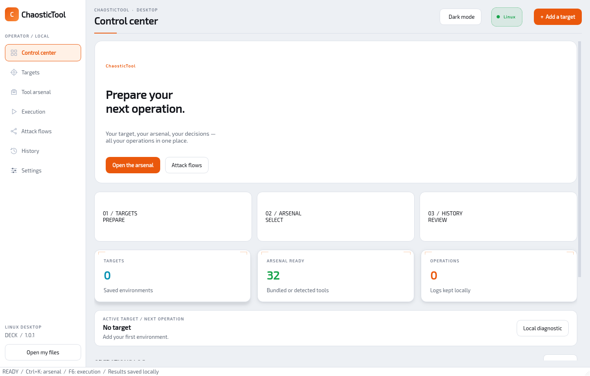
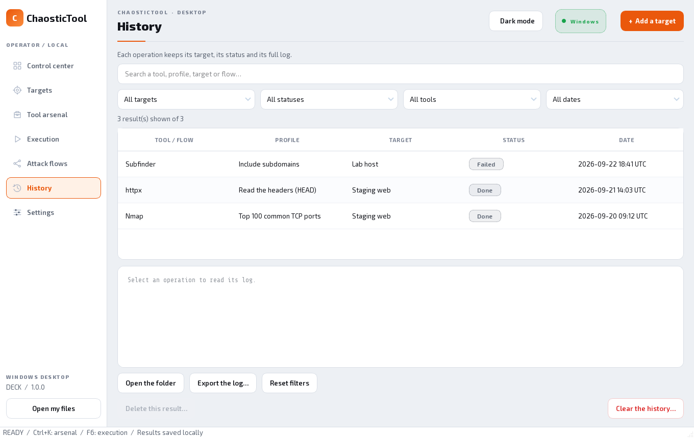

# ChaosticTool Desktop

**Your graphical operations center for Linux desktops.**

Prepare your targets, choose your tools by phase, configure your operations and find their results in a clean interface — in English by default, with a French option — and a light or dark theme. Run local Linux tools with integrated output, interactive input and sudo when a profile requires it.

**[Linux setup guide](README_DESKTOP_LINUX.md)** · **[Development builds](https://github.com/Chaos-Tic/Chaostic-Tool/actions/workflows/desktop.yml)** · **[Windows guide](README_WINDOWS.md)** · **[Linux terminal version](https://github.com/Chaos-Tic/Chaostic-Tool/tree/linux-cli)**



*The application running in a Linux Wayland session with an empty temporary profile. Tool availability depends on the system. The bundle contains no targets or user history.*

## CLI and Desktop, one repository

| Edition | Use | Documentation |
|---|---|---|
| **Desktop / Windows** | Graphical application, forms and results without opening a terminal | Branch [`desktop/windows-app`](https://github.com/Chaos-Tic/Chaostic-Tool/tree/desktop/windows-app), the [Windows guide](README_WINDOWS.md) |
| **Linux CLI** | Terminal experience and CLI-specific functions | Branch [`linux-cli`](https://github.com/Chaos-Tic/Chaostic-Tool/tree/linux-cli), [CLI guide](README_LINUX.md) |
| **Desktop / Linux** | Graphical application with local Linux execution | Branch [`desktop/linux-app`](https://github.com/Chaos-Tic/Chaostic-Tool/tree/desktop/linux-app), [Linux GUI guide](README_DESKTOP_LINUX.md) |
| **Desktop / macOS** | The shared graphical interface on macOS | [Cross-system packages and install](docs/DESKTOP.md) |

The historical `main` branch is now called **`linux-cli`**. The rename does not merge the editions. The first screenshot shows Linux; the following screenshots illustrate the shared interface captured on Windows.

## Download and install

| Linux desktop | Tool package manager | Distribution |
|---|---|---|
| Debian / Ubuntu / Kali / Parrot | apt | Portable `.tar.gz` and user installer |
| Arch / Manjaro | pacman | Portable `.tar.gz` and user installer |
| Fedora | dnf | Portable `.tar.gz` and user installer |

The `desktop/linux-app` branch develops the Linux edition. CI is configured to build Linux x64 and ARM64 alongside Windows and macOS. A workflow configuration is not proof that all six builds have passed; download artifacts from a successful run for this branch. See the [Linux guide](README_DESKTOP_LINUX.md) for prerequisites and source installation.

1. Extract a Linux bundle for your architecture. The GitHub “Source code” archives do not contain a built application.
2. Run `./ChaosticTool` from its folder, or `sh install.sh` to add it to the applications menu. Launch the GUI as your normal user.
3. Choose **Settings → Linux environment → Linux on this computer**, then verify the connection to detect installed tools.
4. Try the local diagnostic, then add a target and install the tools you need. The Linux pack uses your configured distro repositories and reports missing packages.

The Linux build produces an archive and its SHA-256 fingerprint in `release/`. Published release assets are separate from development artifacts. For the existing Windows release, use the [Windows guide](README_WINDOWS.md).

### Application and tool compatibility

Linux bundles target glibc desktops, not Alpine/musl. Tool dependencies are separate: some require a service, an API key, a GPU or Wi-Fi driver, or special rights. Native interactive and privileged profiles use a local pseudo-terminal; Windows-only WinPEAS is unavailable on Linux. Tor/proxychains and VPN guard remain CLI features.

The build is tested automatically. This does not validate every GPU, antivirus, Wi-Fi adapter and external tool on every machine. See the [tool matrix](docs/WINDOWS_PORT.md) for functional limits.

## Your first operation

1. **Targets → Add a target**: enter a domain, an IPv4/IPv6 or a URL and a recognizable name. Adding alone starts no connection.
2. **Tool arsenal**: search for a tool or select its phase. Its status shows whether it is available or needs preparation.
3. **Configure and run**: check the target, the engine and the profile. The fields depend on the tool.
4. **Execution**: follow the output and the status. **Stop** interrupts the operation; the partial log stays available.
5. **History**: find the result, its target, its date and its status, then open the produced files.

To explore the interface without a remote scan, use **Local diagnostic** or a `localhost` resolution. Use the tools and flows within your authorizations.

## The seven workspaces

| Screen | Function |
|---|---|
| **Control center** | Active target, bundled/detected tools, kept operations and shortcuts |
| **Targets** | Add, name and select environments |
| **Tool arsenal** | Search, ordering by phase, compatible installs and profiles |
| **Execution** | Configuration, output, interactive-session input and stop |
| **Attack flows** | Flow-specific target and a sequence of guided steps |
| **History** | Combinable filters, viewing and deletion of results |
| **Settings** | Linux/WSL/SSH, light/dark theme, language, animations, data paths and tool detection |

**Shortcuts:** `Ctrl+K` opens the arsenal search; `F6` opens execution. Commands stay keyboard-accessible.

## Catalog: 48 CLI tools and 4 extra diagnostics


Desktop reuses the **48 original tools**, with their graphical profiles, and adds **4 diagnostics**. The ordering by phase follows the CLI's. Options are presented in forms.

**A catalog entry does not mean its program is installed.** The statuses distinguish bundled functions, detected executables and missing dependencies. A native pack and individual installs are offered when the program can be managed on your platform.

| Engine | Use | Preparation |
|---|---|---|
| **Native** | Bundled functions and tools compatible with the host system | None for bundled functions; install or executable path for the others |
| **WSL** | Linux tools under Windows, including Nmap/RustScan via the configured environment | WSL, distribution and Linux dependencies |
| **Local Linux** | Desktop launched under Linux | Tools installed on that system |
| **SSH** | Your remote Linux machine or VM | SSH access and tools on that machine |

Managed portable archives are verified by SHA-256; managed Python tools use isolated environments. Some functions depend on services or specific hardware. **Tor/proxychains and VPN guard** remain specific to the CLI edition.

## Prepare Linux tools

In **Settings → Linux environment**, select **Linux on this computer** and
verify the inventory. Install the selected tools from the arsenal. The Linux
pack supports apt, pacman and dnf using your configured repositories. Privileged
profiles request sudo in Execution; run the GUI as your ordinary user.

Wireless and GPU tools require suitable hardware and drivers. See the
[Linux setup guide](README_DESKTOP_LINUX.md) for local execution, SSH and builds.
WSL preparation applies only to the [Windows edition](README_WINDOWS.md).

## Attack flows: one target and explicit steps


The three original flows are available, with creation, editing, import and export of custom flows. First choose **Flow target**: the session keeps that target even if you later select another global target.

Each step offers its tool and its configuration. After a success, the selection advances; **the next step is not run automatically**. Changing an existing session's target offers a new session and keeps the previous results. An active operation locks changes incompatible with its tracking.

Flow results stay associated with its target, including for local steps. Check the availability of the tools and the engine before launching.

## A history under your control



Combine the **target, tool, status, period** filters (24 hours, 7 days, 30 days or all) and **text search**. The counter distinguishes the displayed results from the whole kept set. Reset the filters to find the other operations.

- **Delete a result** removes the operation and its files after confirmation. Other results are kept and flow references are updated.
- **Clear the history** deletes results and flow sessions after confirmation. Targets, settings, installed tools and custom flow definitions stay available.
- An active operation must be finished or stopped before deletion.

Folders have descriptive names to recognize the tool and the context. Output limited on screen does not replace the full saved log. [Storage and history](README_WINDOWS.md).

## Clean interface, light or dark theme


Desktop 1.0 uses a **clean, uncluttered interface**: light background, plenty of room, a single orange accent, calm typography. Cards stand out with soft shadows and animate slightly on hover. A full **dark theme** is available: the button at the top of the window toggles light/dark and your choice is remembered.

In **Settings → Appearance**, disable the animations or choose a 60/30 target frame rate for the ambiance. That rate is not an FPS guarantee. Tables and logs stay stable. Rendering uses **Qt/PySide6**, with no game engine.

## Personal data, updates and uninstall

Data is separate from the program. On Linux, the default location is:

```text
$XDG_DATA_HOME/ChaosticTool/Desktop
# Default: ~/.local/share/ChaosticTool/Desktop
```

The public installer bundles **no history, no targets and no personal Linux configuration**. The build checks for the absence of profile files in the package. The packaged-application test verifies an empty initial profile before running its diagnostic.

Desktop 1.0 also checks for new versions and notifies you: **Settings → About → Check for updates**. The check installs nothing automatically; it opens the download page.

To back up, close Desktop and copy your data folder. To update, close the application then install the new Linux bundle: your data is kept. A reinstall on your PC therefore normally finds your history; that history is not shared with other users.

Run `sh "${XDG_DATA_HOME:-$HOME/.local/share}/ChaosticTool/application/uninstall.sh"` to remove the installed application and its menu entry. Personal data and SSH environments are kept. [Linux installation and removal](README_DESKTOP_LINUX.md).

## Quick troubleshooting

| Symptom | Check |
|---|---|
| Tool present but unavailable | Check the engine, dependencies and Linux inventory; refresh detection |
| Qt platform plugin error | Install the graphics libraries listed in the Linux guide |
| Missing Linux tool | Verify the selected engine and refresh its inventory |
| Wrong target in a flow | Check **Flow target** and the session, independent from the global target |
| Result seemingly gone | Reset the filters and check the data folder in use |
| Animations too costly | Choose 30 fps or disable the animations |
| Application error | Check the operation log and, if present, `desktop-errors.log` in the data folder |

To report a problem, state the Desktop version, Linux distribution and desktop session, the architecture, the engine, the reproduction steps and the exact message. Remove secrets and private information from shared logs.

## Documentation and development

See [CONTRIBUTING](CONTRIBUTING.md) for branch targets and validation.


| Document | Content |
|---|---|
| [Linux GUI guide](README_DESKTOP_LINUX.md) | Linux setup, local tools and builds |
| [Windows guide](README_WINDOWS.md) | Install, detailed use, WSL/SSH, troubleshooting and maintenance |
| [Cross-system Desktop](docs/DESKTOP.md) | Linux/macOS, architectures and packages |
| [Catalog and compatibility](docs/WINDOWS_PORT.md) | Tools, engines and limits |
| [Linux CLI](README_LINUX.md) | The terminal experience |
| [Repository rules](docs/REPOSITORY_RULES.md) | Branches, protection of `linux-cli` and contributions |
| [Third-party licenses](docs/THIRD_PARTY.md) | Dependencies and redistribution |

The [Desktop workflow](https://github.com/Chaos-Tic/Chaostic-Tool/actions/workflows/desktop.yml) builds Windows, Linux and macOS and tests the packaged applications. The Windows 1.0.1 release is pinned to `desktop-v1.0.1`; branch heads may contain newer changes. The [Desktop guide](docs/DESKTOP.md) describes running from source and building the packages.

[MIT license](LICENSE) · English by default, French option · **Documentation revised for Desktop 1.0.1**
