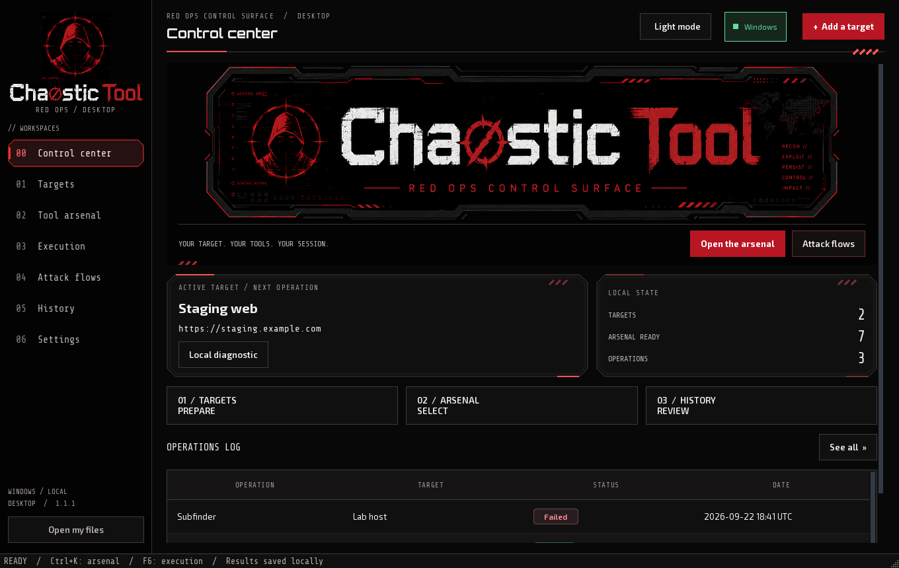
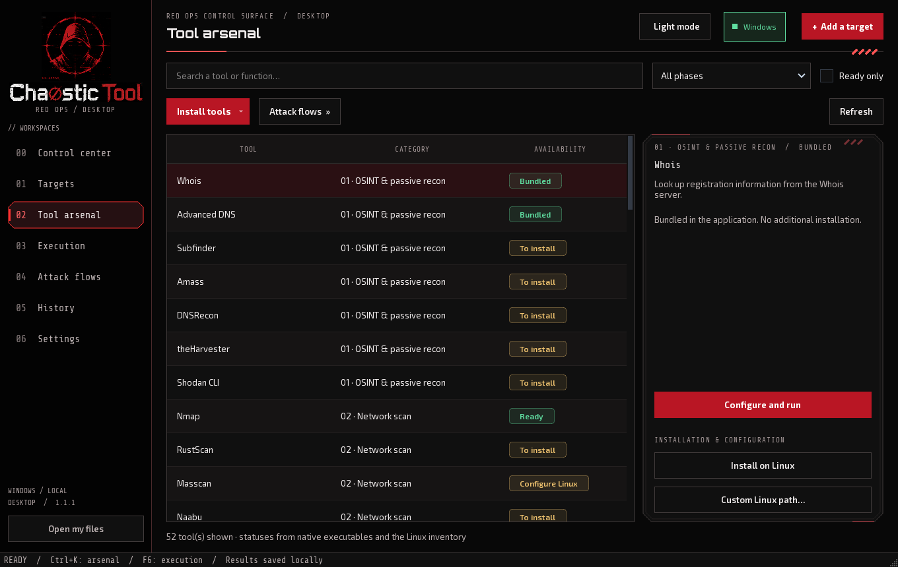
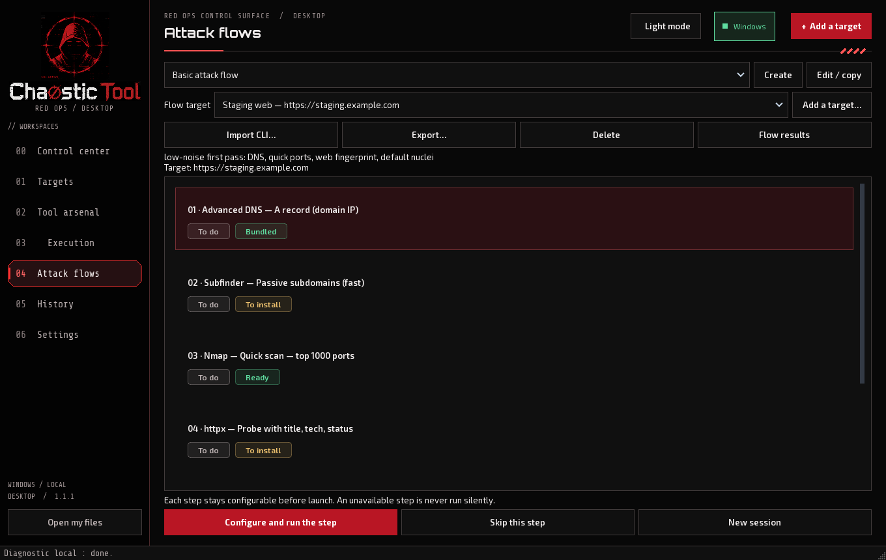
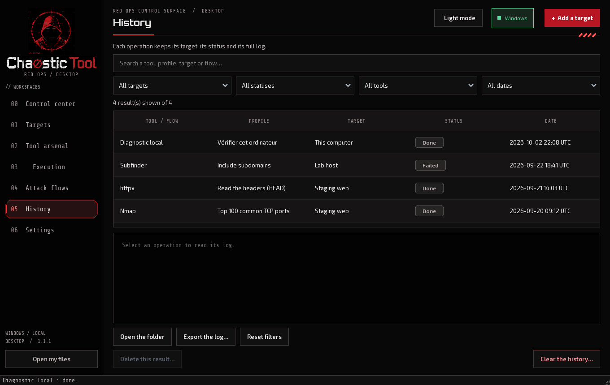
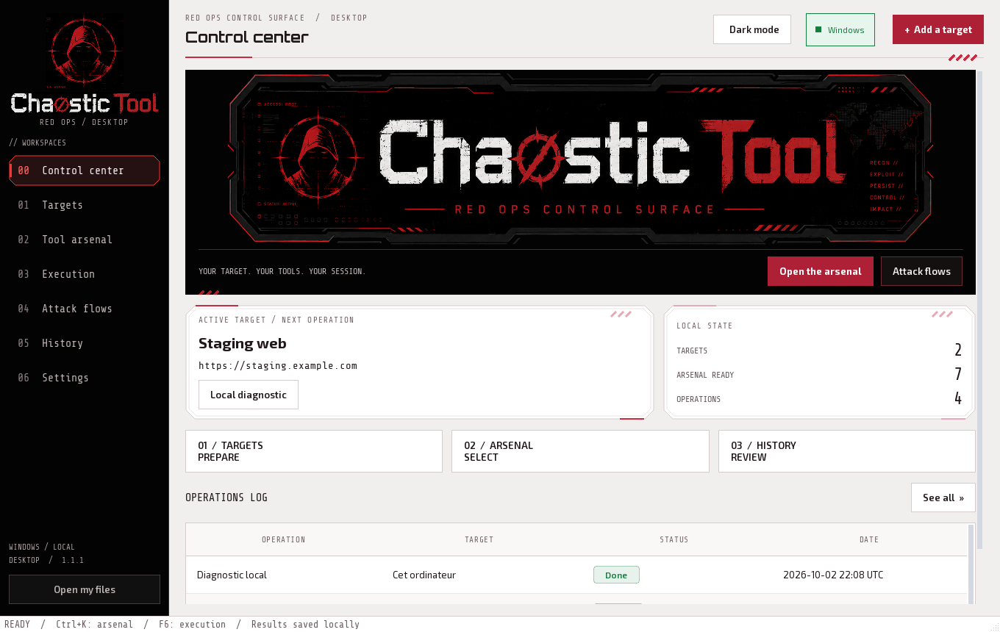

# ChaosticTool Desktop

**Your graphical operations center for Windows 10 and Windows 11.**

Prepare your targets, choose your tools by phase, configure your operations and find their results in a clean interface — in English by default, with a French option — and the CLI-inspired Red Ops theme (dark by default for new profiles, with a light option). The application has its own installer and uninstalls from Windows.

**[Download Desktop 1.1.5](https://github.com/Chaos-Tic/Chaostic-Tool/releases/tag/desktop-v1.1.5)** · **[Detailed Windows guide](README_WINDOWS.md)** · **[Linux terminal version](https://github.com/Chaos-Tic/Chaostic-Tool/tree/linux-cli)**



*Real application, with an isolated demo profile. The available tools depend on the machine used for the capture. The releases contain neither this profile nor the developer's history.*

## CLI and Desktop, one repository

| Edition | Use | Documentation |
|---|---|---|
| **Desktop / Windows** | Graphical application, forms and results without opening a terminal | Branch [`desktop/windows-app`](https://github.com/Chaos-Tic/Chaostic-Tool/tree/desktop/windows-app), this README and the [Windows guide](README_WINDOWS.md) |
| **Linux CLI** | Terminal experience and CLI-specific functions | Branch [`linux-cli`](https://github.com/Chaos-Tic/Chaostic-Tool/tree/linux-cli), [CLI guide](README_LINUX.md) |
| **Desktop / Linux** | Graphical application with distro integration | [Linux branch and guide](https://github.com/Chaos-Tic/Chaostic-Tool/tree/desktop/linux-app) |
| **Desktop / macOS** | Shared graphical interface, Intel and Apple Silicon packages | [Cross-system packages and install](docs/DESKTOP.md) |

The historical `main` branch is now called **`linux-cli`**. The rename does not merge the editions. This README's captures cover Desktop.

## Download and install

| Your computer | Installer | Target systems |
|---|---|---|
| Intel or AMD 64-bit | [Windows x64](https://github.com/Chaos-Tic/Chaostic-Tool/releases/download/desktop-v1.1.5/ChaosticTool-Setup-1.1.5-windows-x64.exe) | Windows 10 **1809 or later**, Windows 11 |

Version 1.1.5 provides Windows x64 and ARM64 installers. Choose the matching architecture from the release assets.

1. Check your architecture in **Windows Settings → System → About**, then download the matching `.exe`. The GitHub “Source code” archives are not the installer.
2. Run the installation. **Python and Git are not needed** to start the distributed application.
3. Open **ChaosticTool Desktop** from the Start menu. **Open my files** gives access to your data space.
4. Try the local diagnostic, then add a target and install the tools you need.

The installer and its SHA-256 fingerprint are in the [release](https://github.com/Chaos-Tic/Chaostic-Tool/releases/tag/desktop-v1.1.5). Desktop 1.1.5 is a **stable public release**, without a Windows publisher signature; Windows may show a reputation warning. The macOS distribution is not notarized.

### Application and tool compatibility

The interface is packaged for the system above; 32-bit Windows is not supported. Tool dependencies are separate: some run natively, others require Linux, a service, an API key, a driver or special rights. WSL 2 also depends on virtualization and the machine's policies.

The build is tested automatically. This does not validate every GPU, antivirus, Wi-Fi adapter and external tool on every machine. See the [tool matrix](docs/WINDOWS_PORT.md) for functional limits.

## Your first operation

1. **Targets → Add a target**: enter a domain, an IPv4/IPv6 or a URL and a recognizable name. Adding alone starts no connection.
2. **Tool arsenal**: search for a tool or select its phase. Its status shows whether it is available or needs preparation.
3. **Configure and run**: check the target, the engine and the profile. The fields depend on the tool.
4. **Execution**: follow the output and the status. **Stop** interrupts the operation; the partial log stays available.
5. **History**: find the result, its target, its date and its status, then open the produced files.

To explore the interface without a remote scan, use **Local diagnostic** or a `localhost` resolution. Use the tools and flows within your authorizations.

## The seven workspaces

| Screen | Function |
|---|---|
| **Control center** | Active target, bundled/detected tools, kept operations and shortcuts |
| **Targets** | Add, name and select environments |
| **Tool arsenal** | Search, ordering by phase, compatible installs and profiles |
| **Execution** | Configuration, output, interactive-session input and stop |
| **Attack flows** | Flow-specific target and a sequence of guided steps |
| **History** | Combinable filters, viewing and deletion of results |
| **Settings** | Linux/WSL/SSH, light/dark theme, language, animations, data paths and tool detection |

**Shortcuts:** `Ctrl+K` opens the arsenal search; `F6` opens execution. Commands stay keyboard-accessible.

## Catalog: 48 CLI tools and 4 extra diagnostics



Desktop reuses the **48 original tools**, with their graphical profiles, and adds **4 diagnostics**. The ordering by phase follows the CLI's. Options are presented in forms.

**A catalog entry does not mean its program is installed.** The statuses distinguish bundled functions, detected executables and missing dependencies. A native pack and individual installs are offered when the program can be managed on your platform.

| Engine | Use | Preparation |
|---|---|---|
| **Native** | Bundled functions and tools compatible with the host system | None for bundled functions; install or executable path for the others |
| **WSL** | Linux tools under Windows, including Nmap/RustScan via the configured environment | WSL, distribution and Linux dependencies |
| **Local Linux** | Desktop launched under Linux | Tools installed on that system |
| **SSH** | Your remote Linux machine or VM | SSH access and tools on that machine |

Managed portable archives are verified by SHA-256; managed Python tools use isolated environments. Some functions depend on services or specific hardware. **Tor/proxychains and VPN guard** remain specific to the CLI edition.

## Prepare WSL and Kali Linux

In **Settings → Install WSL and Kali Linux…**, Desktop detects the environment, offers WSL/Kali preparation and configures the Linux components it manages. Enabling Windows features may require an administrator elevation.

**If Windows asks for a restart, restart the PC before resuming.** A finished download does not mean the distribution is usable. Desktop keeps the preparation step and distinguishes a required restart from a ready environment. An unfinished preparation can be resumed at the next launch.

The dedicated Linux account `chaostic-tool` is used for ordinary operations. Profiles that explicitly request privileges are handled separately. Your default WSL distribution is not replaced.

WSL is not needed to open Desktop or use the native functions. It does not automatically grant access to low-level Wi-Fi functions: interfaces, drivers and hardware must be available in the chosen environment. [Detailed preparation and troubleshooting](README_WINDOWS.md).

## Attack flows: one target and explicit steps



The three original flows are available, with creation, editing, import and export of custom flows. First choose **Flow target**: the session keeps that target even if you later select another global target.

Each step offers its tool and its configuration. After a success, the selection advances; **the next step is not run automatically**. Changing an existing session's target offers a new session and keeps the previous results. An active operation locks changes incompatible with its tracking.

Flow results stay associated with its target, including for local steps. Check the availability of the tools and the engine before launching.

## A history under your control



Combine the **target, tool, status, period** filters (24 hours, 7 days, 30 days or all) and **text search**. The counter distinguishes the displayed results from the whole kept set. Reset the filters to find the other operations.

- **Delete a result** removes the operation and its files after confirmation. Other results are kept and flow references are updated.
- **Clear the history** deletes results and flow sessions after confirmation. Targets, settings, installed tools and custom flow definitions stay available.
- An active operation must be finished or stopped before deletion.

Folders have descriptive names to recognize the tool and the context. Output limited on screen does not replace the full saved log. [Storage and history](README_WINDOWS.md).

## Red Ops: the CLI identity on Desktop



Desktop 1.1.5 carries the **original CLI README identity**: the hooded mascot, distressed white/red wordmark, deep black surfaces, numbered navigation and double industrial frames. The active target and local counters share a compact operation panel above the shortcuts. New profiles start dark; existing theme preferences are preserved. The light theme uses the same identity, and the top button switches between both palettes.

In **Settings → Appearance**, disable the animations or choose a 60/30 target frame rate for the ambiance. That rate is not an FPS guarantee. Tables and logs stay stable. Rendering uses **Qt/PySide6**, with no game engine.

## Personal data, updates and uninstall

Data is separate from the program. On Windows, the default location is:

```text
%LOCALAPPDATA%\ChaosticTool\Desktop
```

The public installer bundles **no history, no targets and no personal Linux configuration**. The build checks for the absence of profile files in the package. The packaged-application test verifies an empty initial profile before running its diagnostic.

Desktop also checks for new versions and notifies you: **Settings → About → Check for updates**. The check installs nothing automatically; it opens the download page.

To back up, close Desktop and copy your data folder. To update, close the application then run the new installer: your data is kept. A reinstall on your PC therefore normally finds your history; that history is not shared with other users.

Uninstall from **Windows Settings → Apps → ChaosticTool Desktop → Uninstall**. Personal data is kept. Desktop does not remove your WSL or SSH environments when it uninstalls. [Maintenance and backups](README_WINDOWS.md#maintenance).

## Quick troubleshooting

| Symptom | Check |
|---|---|
| Tool present but unavailable | Check the engine, dependencies and Linux inventory; refresh detection |
| WSL restart requested | Restart Windows then resume the setup before a Linux launch |
| `WSL_E_DISTRO_NOT_FOUND` | Distribution unavailable: resume the setup after enabling/restarting |
| Wrong target in a flow | Check **Flow target** and the session, independent from the global target |
| Result seemingly gone | Reset the filters and check the data folder in use |
| Animations too costly | Choose 30 fps or disable the animations |
| Application error | Check the operation log and, if present, `desktop-errors.log` in the data folder |

To report a problem, state the Desktop and Windows versions, the architecture, the engine, the reproduction steps and the exact message. Remove secrets and private information from shared logs.

## Documentation and development

See [CONTRIBUTING](CONTRIBUTING.md) for branch targets and validation.


| Document | Content |
|---|---|
| [Windows guide](README_WINDOWS.md) | Install, detailed use, WSL/SSH, troubleshooting and maintenance |
| [Cross-system Desktop](docs/DESKTOP.md) | Linux/macOS, architectures and packages |
| [Catalog and compatibility](docs/WINDOWS_PORT.md) | Tools, engines and limits |
| [Linux CLI](README_LINUX.md) | The terminal experience |
| [Repository rules](docs/REPOSITORY_RULES.md) | Branches, protection of `linux-cli` and contributions |
| [Third-party licenses](docs/THIRD_PARTY.md) | Dependencies and redistribution |

The [Desktop workflow](https://github.com/Chaos-Tic/Chaostic-Tool/actions/workflows/desktop.yml) builds Windows, Linux and macOS and tests the packaged applications. The Windows 1.1.5 release is pinned to `desktop-v1.1.5`; branch heads may contain newer changes. The [Desktop guide](docs/DESKTOP.md) describes running from source and building the packages.

[MIT license](LICENSE) · English by default, French option · **Documentation revised for Desktop 1.1.5**
