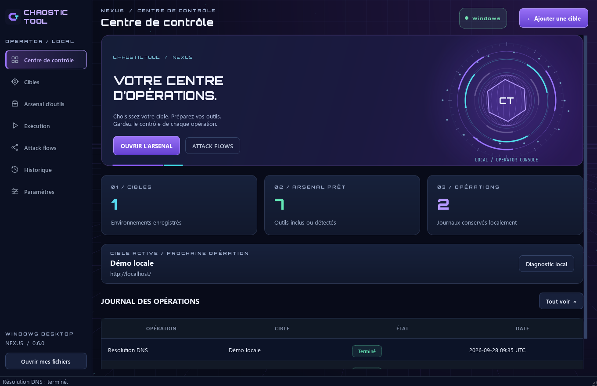
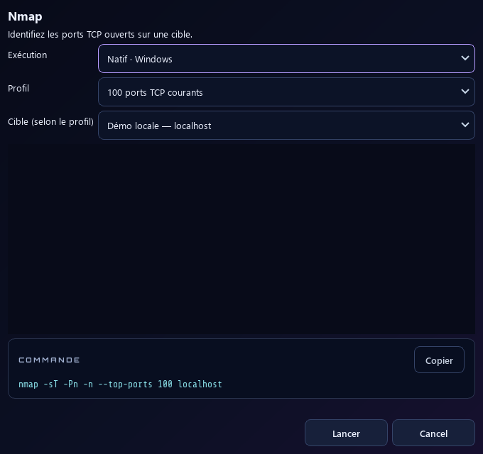

# ChaosticTool Desktop · NEXUS

**L'application graphique pour Windows 10 et Windows 11.** Retrouvez les outils, leurs formulaires de configuration et les résultats depuis la même interface.

**[Télécharger Desktop 0.6.1](https://github.com/Chaos-Tic/Chaostic-Tool/releases/tag/desktop-v0.6.1)** · **[Guide Windows](README_WINDOWS.md)** · [Version Linux en terminal](README_LINUX.md)

*Capture réelle de Desktop 0.6.1 avec la nouvelle interface NEXUS. Les états affichés dépendent de votre configuration.*

> **[Guide Windows illustré](README_WINDOWS.md)** : premier lancement pas à pas, lecture des états, installation des outils, configuration WSL/SSH, sauvegarde et dépannage.

## Installer sous Windows

| Votre système | Téléchargement |
|---|---|
| Windows 10 64 bits, version 1809+, ou Windows 11 sur Intel/AMD | [Installateur x64](https://github.com/Chaos-Tic/Chaostic-Tool/releases/download/desktop-v0.6.1/ChaosticTool-Setup-0.6.1-windows-x64.exe) |
| Windows 11 sur ARM64 | [Installateur ARM64](https://github.com/Chaos-Tic/Chaostic-Tool/releases/download/desktop-v0.6.1/ChaosticTool-Setup-0.6.1-windows-arm64.exe) |

Ouvrez l'installateur, puis lancez **ChaosticTool Desktop** depuis le menu Démarrer. Python et Git ne sont pas nécessaires pour lancer l'application installée. Les raccourcis et la désinstallation Windows sont pris en charge.

Pour mettre à jour une installation existante, fermez l'application et lancez le nouvel installateur ; vos données sont conservées. Consultez le [guide Windows complet](README_WINDOWS.md) pour les prérequis, les limites de compatibilité et la désinstallation.

## Des profils configurables dans l'interface

Le catalogue réunit **48 outils d'origine et 4 diagnostics supplémentaires**. Chaque profil propose ses champs de configuration ; les sorties et l'historique sont accessibles depuis l'application.

Les outils compatibles s'exécutent nativement. Les outils Linux passent par un environnement configuré : WSL sous Windows, Linux local ou une machine Linux en SSH. Les 52 entrées du catalogue ne sont pas toutes installées au premier démarrage. Certaines nécessitent des clés API, des services, des droits particuliers ou du matériel compatible.

## Choisir sa documentation

- **[Windows Desktop](README_WINDOWS.md)** : captures de l'application graphique, installation, utilisation, mise à jour et désinstallation.
- **[Linux et macOS Desktop](docs/DESKTOP.md)** : paquets x64/ARM64 et guide multi-systèmes.
- **[Linux CLI](README_LINUX.md)** : interface en terminal, captures et documentation de la version d'origine.
- **[Catalogue et compatibilité des outils](docs/WINDOWS_PORT.md)**.

Desktop 0.6.1 est une préversion. Les builds actuels sont sans signature d'éditeur Windows ni notarisation Apple ; les protections du système peuvent afficher un avertissement ou bloquer l'ouverture. Desktop reprend les trois attack flows CLI et permet de créer, modifier, importer et exporter des flows personnalisés. Tor/proxychains et VPN guard restent propres à la CLI.

[Code sous licence MIT](LICENSE) · [Builds Windows, Linux et macOS](https://github.com/Chaos-Tic/Chaostic-Tool/actions/workflows/desktop.yml)

### NEXUS · Desktop 0.6

Identité violet/cyan, noyau orbital et particules animés, survols réactifs, transitions de pages, badges lisibles et icônes haute densité corrigées. Ctrl+K pour chercher un outil, F6 pour suivre l’exécution. Les animations sont désactivables dans les paramètres et suspendues sur les panneaux masqués. [Guide visuel et fonctionnement](README_WINDOWS.md#identité-nexus--interface-et-animations).
