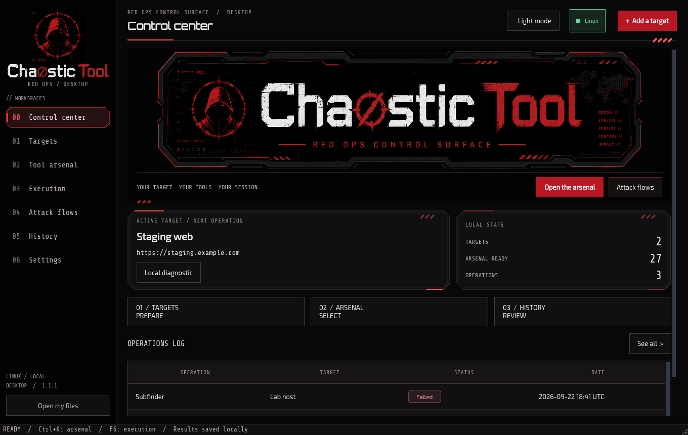

# ChaosticTool Desktop on Linux

The `desktop/linux-app` branch uses the shared PySide6 interface and adds Linux
execution and distro package installation. The CLI remains on `linux-cli`;
the Windows edition remains on `desktop/windows-app`.

## Desktop 1.1.1 downloads

Download the [Linux x64 archive](https://github.com/Chaos-Tic/Chaostic-Tool/releases/download/desktop-v1.1.1/ChaosticTool-1.1.1-linux-x64.tar.gz)
or [Linux ARM64 archive](https://github.com/Chaos-Tic/Chaostic-Tool/releases/download/desktop-v1.1.1/ChaosticTool-1.1.1-linux-arm64.tar.gz).
The release includes SHA-256 fingerprints. Extract the archive and run `./ChaosticTool`,
or `sh install.sh` from its folder to add the application to your menu.

The Red Ops interface inherits the CLI's charcoal/red palette and technical
typography. New profiles use dark mode; existing theme preferences are preserved.



## Run from source

Use Python 3.14 and a desktop session with the Qt graphics libraries installed.
On Debian/Ubuntu, the graphics packages are:

```sh
sudo apt install libegl1 libopengl0 libxkbcommon0 libxcb-cursor0 libxcb-icccm4 libxcb-keysyms1 libxcb-shape0 libxcb-xinerama0
```

Then prepare an isolated Python environment:

```sh
git clone --branch desktop/linux-app https://github.com/Chaos-Tic/Chaostic-Tool.git
cd Chaostic-Tool
python3.14 -m venv .venv
. .venv/bin/activate
python -m pip install -r requirements-desktop.txt
python chaostic_desktop.py
```

Launch the application as your normal user. Profiles that need elevated rights
request sudo through the input field in **Execution**. Keep **Hide** selected
when entering a password. The GUI does not need to run as root.

## Detect and install tools

1. Open **Settings → Linux environment** and select **Linux on this computer**.
2. Verify the connection to inventory installed tools and network interfaces.
3. In the arsenal, install a selected tool on Linux or choose the Linux pack.
4. Verify the inventory again after a manual installation or configure an
   absolute executable path in the selected Linux environment.

| Distribution family | Installer |
|---|---|
| Debian, Ubuntu, Kali, Parrot | apt |
| Arch, Manjaro | pacman |
| Fedora | dnf |

The pack uses explicit package names and checks the configured repositories.
It reports incomplete selections and confirms installed packages. It adds no
repositories, builds no AUR packages and performs no full system upgrade. Arch
users should maintain their package databases with their normal system update
workflow before installing tools. Some tools require manual installation or
the CLI's optional full installation profile.

Native interactive and privileged profiles run in a local pseudo-terminal,
even when a separate SSH environment is configured. Selecting the Linux
environment explicitly uses that configured local or remote environment.
SSH input files must exist on the remote host; automatic transfer is not included.

WinPEAS is Windows-only. GPU cracking and wireless operations still require
compatible drivers and hardware. Tor/proxychains and VPN guard are CLI features.

## Build a portable Linux bundle

```sh
python -m pip install -r requirements-build.txt
python scripts/build-desktop.py
python scripts/smoke-desktop.py
```

The build runs the test suite and writes a `.tar.gz` plus its SHA-256 fingerprint
to `release/`. Extract it, run `./ChaosticTool`, or execute `sh install.sh` from
the extracted folder to add the application to your menu. This is the installer
inside the GUI bundle; the repository-root `install.sh` installs the CLI.

The bundled installer copies the application into
`$XDG_DATA_HOME/ChaosticTool/application`, or
`~/.local/share/ChaosticTool/application`. Run its `uninstall.sh` to remove the
application and menu entry; saved targets, settings and results are retained.

CI builds target Ubuntu 22.04 x64 and Ubuntu 24.04 ARM64. See
[cross-system requirements](docs/DESKTOP.md) for the supported glibc baselines.
A bundle built locally inherits the host's library requirements, so build on
the oldest supported distribution for wider compatibility. Automated tests
use Qt's offscreen mode; verify the interface in your real Wayland/X11 session
before distributing a release.
