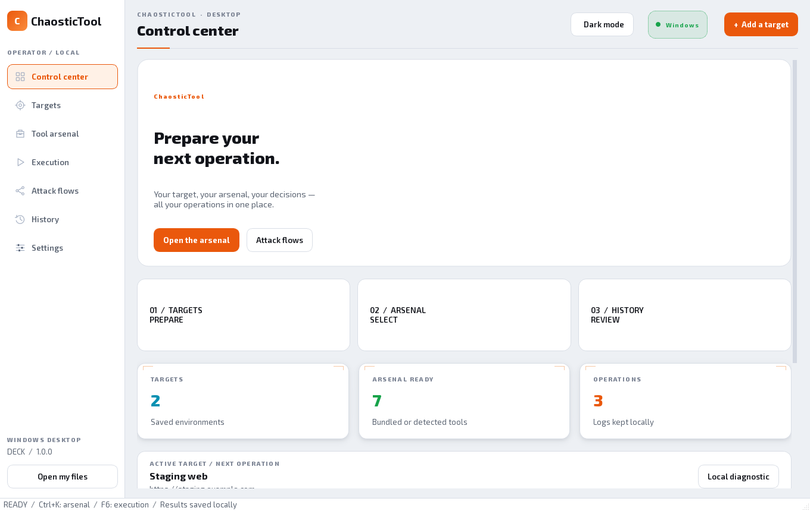
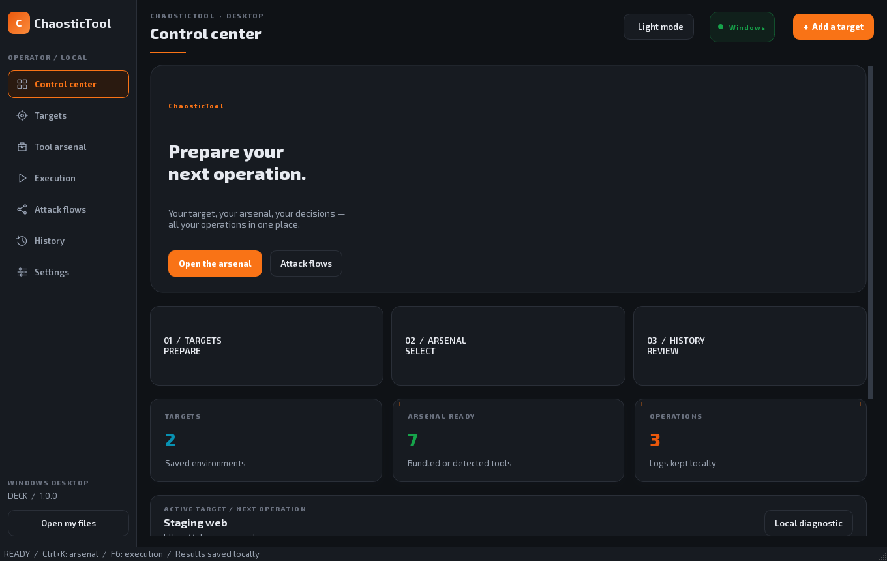
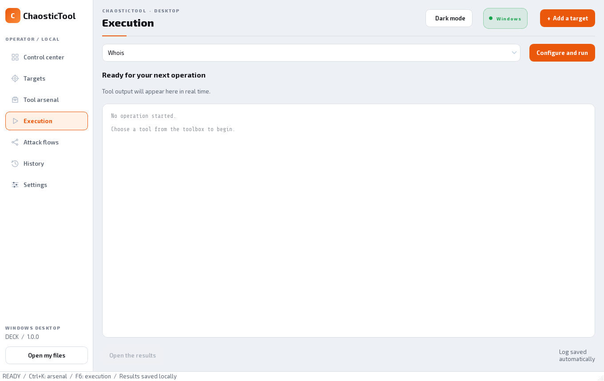
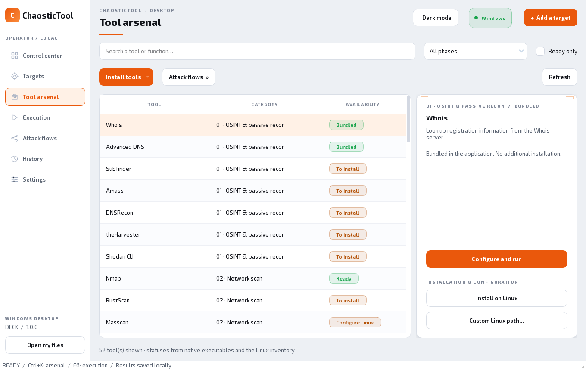
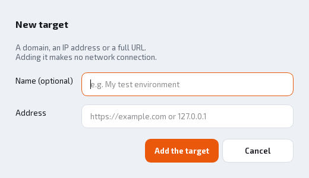
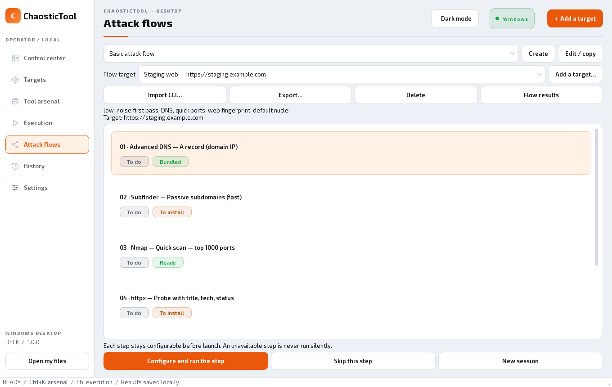
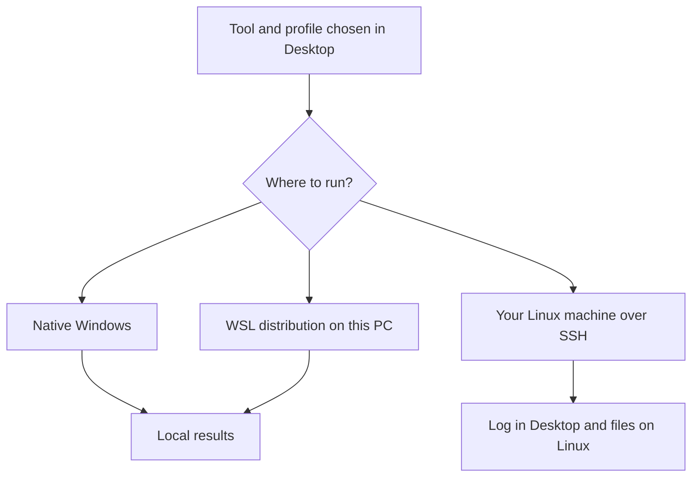
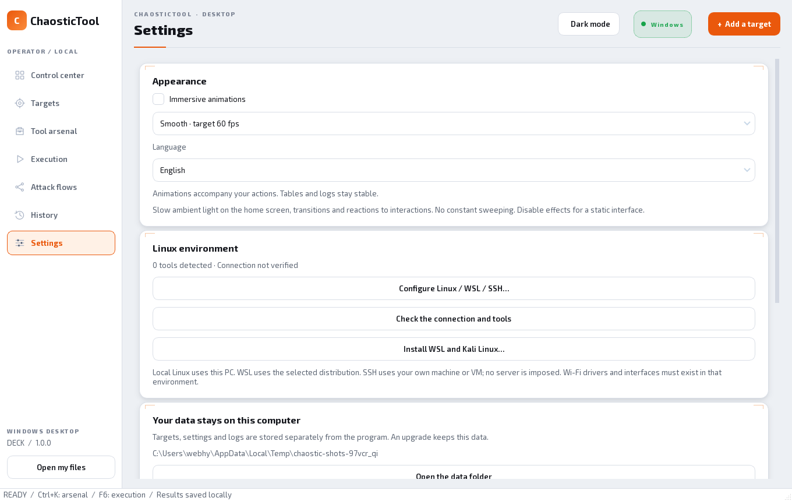

<div align="center">

# ChaosticTool Desktop · Windows

### Your tools. Your targets. Your results, in a graphical interface.

**Windows 10 / 11 · x64 · Version 1.0.0**

**[Download for Intel / AMD (x64)](https://github.com/Chaos-Tic/Chaostic-Tool/releases/download/desktop-v1.0.0/ChaosticTool-Setup-1.0.0-windows-x64.exe)**

[All downloads and checksums](https://github.com/Chaos-Tic/Chaostic-Tool/releases/tag/desktop-v1.0.0) · [Linux CLI](README_LINUX.md) · [Linux / macOS Desktop](docs/DESKTOP.md)

</div>

ChaosticTool Desktop brings together a tool catalog, launch forms, an execution view and a local history. You choose a target when a profile needs one, configure the operation and find its log inside the application.



*The home screen is captured from Desktop 1.0.0 with an isolated demo profile. The
number of ready tools depends on the machine used for the capture; no demo profile
or personal history is shipped in the installer.*

> **Before you start**
>
> The catalog contains **48 original tools and 4 additional diagnostics**, i.e. **52 entries**. A catalog entry is not an already-installed dependency. Some operations require Linux, special privileges, an API key, a service or suitable hardware. The installed application needs neither Python nor Git to start.

## The interface language

The application starts in **English** by default. You can switch it to **French** at any
time from **Settings → Appearance → Language**; the choice is saved and applied
immediately. Every screen, form, dialog and status message follows the selected
language.

## In this guide

- [1. Choose your installation](#installation)
- [2. Succeed with your first operation](#first-operation)
- [3. Understand the screens and statuses](#interface)
- [4. Install and configure the tools](#tools)
- [5. Choose between Windows, WSL and SSH](#environments)
- [6. Find and back up your data](#data)
- [7. Update or uninstall](#maintenance)
- [8. Troubleshoot](#troubleshooting)
- [9. Compatibility, tests and limits](#validation)
- [10. Development and references](#references)

## Interface and animations

Desktop 1.0.0 uses a clean, light design: a white background with an orange accent,
rounded cards and calm typography, plus an optional dark mode. Home-screen light
evolves slowly; buttons and transitions react to your actions. The arsenal, history
and settings stay quiet at rest.

- **Ctrl+K** opens the arsenal search; **F6** opens Execution.
- **Settings → Appearance** keeps the light/dark theme, the language and the choice
  of animations with a 30/60 target frame rate. Disabling effects does not change
  operations.
- Hidden panels and a minimized window are not animated.
- The log keeps a stable background. A fixed pulse on its edge marks an active
  operation, with no horizontal or vertical sweeping.
- Counters describe real data.



<a id="installation"></a>
## 1. Choose your installation

### Which file to download?

| Your computer | Version 1.0.0 file | Windows scope |
|---|---|---|
| Intel or AMD 64-bit | `ChaosticTool-Setup-1.0.0-windows-x64.exe` | Windows 10 version 1809+ or Windows 11 |
| ARM64, e.g. a Snapdragon PC | Not shipped in 1.0.0 (planned) | Windows 11 ARM64 |
| 32-bit Windows, Windows 7 or Windows 8/8.1 | No compatible package | Not supported |

In **Windows Settings → System → About**, check **System type**. To find your Windows 10 version, open `winver` from the Start menu. An ARM64 archive being available for the application does not guarantee that every third-party tool also has an ARM64 binary.

**The application and WSL have distinct prerequisites.** The application installer declares Windows 10 1809 as its minimum. The WSL procedure used by its preparation button requires Windows 10 **2004 / build 19041 or later**, or Windows 11. Native tools do not need WSL. [Microsoft requirements for this WSL procedure](https://learn.microsoft.com/en-us/windows/wsl/install).

### What do you need?

| Item | For the application | For some tools |
|---|---|---|
| Preinstalled Python or Git | No | An isolated Python can be downloaded automatically for the Python pack |
| Internet connection | To download the installer; not for the local diagnostic | To install dependencies and use online services |
| Windows administrator rights | Not for a per-user install | Possibly for WSL, drivers or some operations |
| Virtualization | No | Required for WSL 2; must be available and enabled on the PC |
| Dedicated GPU / Wi-Fi card | No | Depending on the profile and tool; their drivers still need preparing |
| Disk space and memory | No minimum RAM/disk has been certified for every configuration | Variable, especially with the packs and a Linux distribution |

The exact size of each installer is shown on the Release. Plan for more space for dependencies, Linux and operation results.

### Step-by-step installation

1. On the [Desktop 1.0.0 Release](https://github.com/Chaos-Tic/Chaostic-Tool/releases/tag/desktop-v1.0.0), download the installer for your architecture. The “Source code” files are for development and are not the installer.
2. Open the `.exe` file, choose the wizard language and follow its steps.
3. Keep the suggested folder unless you have a specific need: `%LOCALAPPDATA%\Programs\ChaosticTool`.
4. Tick the desktop shortcut if you want one. The Start menu also offers **ChaosticTool Desktop**.
5. Launch the application, then run the diagnostic described below.

This build has no Windows publisher signature. SmartScreen or a company policy may therefore show a warning or block opening. Check the file's origin; the guide does not ask you to disable your protections.

<details>
<summary>Verify the download checksum — optional, with PowerShell</summary>

Download the matching `.sha256` file from the same Release. In PowerShell, adapt the path of your download:

```powershell
Get-FileHash -Algorithm SHA256 -LiteralPath "$env:USERPROFILE\Downloads\ChaosticTool-Setup-1.0.0-windows-x64.exe"
```

Compare the 64 hexadecimal characters you get with the contents of the `.sha256` file. The comparison verifies that the download matches the published file; it does not replace a publisher signature. You do not need this command to use the interface.

</details>

<a id="first-operation"></a>
## 2. Succeed with your first operation

### Step A — check the application without a target

In **Control center**, click **Local diagnostic**. You can also search for it in **Tool arsenal**, then choose **Configure and run**.

**Expected result:** the **Execution** screen shows the version, the system and “Diagnostic engine operational”. The status turns to **Done**, with exit code `0`. This diagnostic contacts no server and does not require installing an external tool.

### Step B — save a demo target

1. Click **Add a target**.
2. Enter the address `http://localhost` and the name **Local demo**, then save.
3. In **Tool arsenal**, search for **DNS resolution**.
4. Click **Configure and run**, choose **IPv4 and IPv6 addresses**, then select **Local demo**.
5. Click **Run**.

**Expected result:** a loopback address, usually `127.0.0.1` and/or `::1`, appears in **Execution**. You do not need a running web server: this profile resolves the `localhost` name and makes no HTTP request.



*The capture shows the result actually produced for the journey above. IPv6 may not appear on every configuration.*

### Step C — find the result

Click **Open the results**, or go through **History**, select the operation then open its folder or export the log. You find the final status and the produced text even after closing the application.

This journey confirms launching, handling a target and keeping a result. It does not yet validate WSL or external dependencies.

<a id="interface"></a>
## 3. Understand the screens and statuses

| Screen | What it is for | What to look at |
|---|---|---|
| **Control center** | Resume work and run the diagnostic | Active target, detected tools, recent operations |
| **Targets** | Save and select a domain, an IP or a URL | The target chosen for your next operation |
| **Tool arsenal** | Search, install and configure a tool | Availability status, profiles and prerequisites |
| **Execution** | Choose a tool, configure its profile, launch and follow the operation | Configure and run button, log, active stop and results |
| **Attack flows** | Prepare a guided, CLI-compatible chain | Three bundled flows, editor, JSON import/export and step states |
| **History** | Re-read or export a previous operation | Final status and result folder |
| **Settings** | Configure Linux, paths and access the data | Chosen environment and last tool inventory |



*The Network scan filter shows Nmap, RustScan, Masscan and Naabu. The statuses match a fresh profile: their presence in the catalog does not mean their dependencies are already installed.*

### What do the tool statuses mean?

| Status | Meaning | Logical next step |
|---|---|---|
| **Bundled** | Engine shipped with the application | Open the form and fill in the needed parameters |
| **Ready** | Native executable detected | Check any API keys, drivers or services before use |
| **Ready · Linux** | Tool found in the last Linux inventory | Choose the Linux environment in the form |
| **To install** | Native program not detected | Install the tool or select its compatible executable |
| **Configure Linux** | No usable Linux inventory for this tool | Configure WSL/SSH then check the connection |
| **To install · Linux** | Environment detected, but tool absent from its inventory | Install the package on Linux then re-run detection |
| **Service required** | The tool also needs a third-party engine, notably Amass | Configure the service and enter its address in the profile |
| **Install failed** | An attempt failed | Read the log: network, archive, dependency, antivirus… |

**The “Ready tools” counter is not the catalog's total.** It changes with the executables and the Linux inventory. A valid API key, a GPU's capabilities or a Wi-Fi card's monitor mode are not verified by this counter.

### During an operation

Desktop runs one operation at a time. For interactive sessions, use the input field and **Send**; **Hide** masks the input and requests masking if the tool shows it again. **Ctrl+C** sends an interrupt to the Linux session. **Stop** appears during an active operation; it triggers a supervised stop, shows “Stopping…” then disappears. The partial log is kept. The **Configure and run** button becomes available again after the operation finishes or stops.

| Final status | Interpretation |
|---|---|
| **Done** | The process returned success; read the result to interpret its content |
| **Failed** | Launch impossible, tool error or timeout; check the detail and the exit code |
| **Stopped** | Stop requested from the application |
| **Interrupted** | A saved operation was still running during a previous close |

Visible output may be limited to keep the interface responsive. The full log is available in the folder or by export. Operations have maximum durations: about 30 seconds for the bundled diagnostics, 20 minutes for a standard tool, 30 minutes for native/WSL installs and one hour for the Linux pack. These limits are those of version 1.0.0.

<a id="tools"></a>
## 4. Install and configure the tools

### Choose the right button

| Action in **Tool arsenal** | Content / effect |
|---|---|
| **Install the native pack** | Subfinder, ProjectDiscovery's httpx, ffuf, Gobuster, Nuclei, Katana, gau, waybackurls, Dalfox and Naabu, depending on the archives available for your architecture |
| **Install the Python tools** | wafw00f, DNSRecon, theHarvester, Shodan, XSStrike, BloodHound Python, Impacket and sqlmap |
| **Install this tool** | Individual install when a native package is managed; some entries offer other tools such as Hashcat |
| **Configure the program** / executable selection | Use a program already installed and compatible with this PC |
| **Install on Linux** | Install the selected tool in the configured Linux environment |
| **Install the Linux pack** | Install the catalog packages available in this environment's repositories |

Archives are chosen by OS and architecture and checked by SHA-256 before extraction. The Python tools have their own isolated environments; a suitable Python runtime can be downloaded automatically. The main versions are referenced in the [tools manifest](desktop/packages.json), the runtime in [its manifest](desktop/runtimes.json). Not every indirect PyPI dependency is pinned.

A pack install can be **partially successful**: installed tools stay available, even if others fail. The log names the failures. Nmap uses its official installer, downloaded and verified from the application on Windows x64. Some dependencies still require Linux; the presence of an entry does not imply a native binary on every architecture.

### Nmap and RustScan: installation and dependencies

**Nmap on Windows x64:** choose Nmap → Install this tool. Desktop downloads the 7.991 installer from `nmap.org` and compares its SHA-256 with the official fingerprint. The wizard then opens; finish its steps and the Npcap step if needed. Return to Desktop and click **Refresh**. The download alone never marks Nmap “Ready”. An already-installed Nmap can also be selected with **Choose the executable…**. On ARM64, choose a compatible distribution or the Linux engine; the x64 installer is not offered automatically.

**RustScan:** the bundled installation downloads RustScan 2.4.1 from its official Release, verifies the archive and tests `--version`. It exists for Windows x64, Linux x64/ARM64 and macOS Intel/Apple Silicon. The **Target port, without Nmap** profile works on its own. The five CLI profiles also use Nmap; Desktop checks that it is present and makes its folder reachable by the RustScan process. The old `--rate` and `-p 1-65535` parameters are mapped to the current `-b` and `-r` options: the batch size is not a strict packets-per-second limit.

Sources: [Nmap for Windows](https://nmap.org/book/inst-windows.html), [installer fingerprint](https://nmap.org/dist/sigs/nmap-7.991-setup.exe.digest.txt), [RustScan 2.4.1](https://github.com/bee-san/RustScan/releases/tag/2.4.1).

### Fill in a profile



1. Choose **Execution**: native Windows or the configured Linux environment, when those choices exist.
2. Choose the **Profile**. Its fields and needs can change.
3. Select a **Target** only if the profile needs one. A file-processing profile can be local and not use the active target.
4. Select your files with **Browse…**, or fill in the indicated parameters.
5. Read the preview and the messages under the form, then launch.

The capture shows Nmap and its TCP connect profile on the top 100 common ports. The CLI profiles are also available in the selector: full scans, services, UDP, NSE scripts, etc. Npcap and privilege prerequisites are indicated for the relevant profiles. File-processing forms offer their fields and Browse buttons depending on the profile.

Sensitive fields planned by the profiles — password, cookie, API key — are masked in the preview, the command history and the flow managed by Desktop. **Files produced and tool-specific configurations remain your responsibility**: they may keep sensitive information. For example, initializing Shodan configures its key for its later uses.

### Ordering and attack flows

The phase filter follows the CLI's order and memberships: **01 OSINT**, **02 Network scan**, **03 Web enumeration**, **04 Vulnerabilities**, **05 Exploitation**, **06 Post-exploitation**, **07 Passwords**, **08 Windows / Active Directory**, **09 Wi-Fi**, **10 Network & MITM**. A tool shared by several phases appears in each of their views, without being counted several times in the catalog. The four Desktop-specific utilities have their own separate filter.



1. Add then activate a target in **Targets** (or directly in the flow).
2. Open **Attack flows** and choose **Basic**, **Intermediate** or **Advanced**, shared with the CLI.
3. Select a step then **Configure and run the step**. The form uses exactly its CLI profile; you can choose the engine and fill in the fields.
4. Read the log in **Execution**. **Back to flow** returns to the session; after a success, the next step is selected but does not launch automatically.
5. A failed or stopped step can be re-run or explicitly skipped. **Flow results** filters the history by its name. **New session** restarts tracking without deleting previous results.

**Create** opens an editor: name, description, choice of the tool and its profile, add, move and remove steps. **Edit / copy** edits a personal flow and duplicates a bundled flow. **Import CLI…** accepts the JSON dictionary from `custom_flows.json`; the whole set is validated before saving. **Export…** produces the same format. **Delete** removes only custom flows and keeps the logs. The target is fixed for the session; secrets typed in the forms are not stored in the definition file.

Logs stay readable after closing; this version does not automatically restore an interrupted flow session. Tracking files are kept under `flows/history/`. Flows reuse the same dependencies and limits as individual tools: a flow does not silently install a missing tool.

**Explicit flow target.** In Attack flows, select **Flow target** or use **Add a target…**. The launch form receives that target, distinct from the global target. Each session keeps its target; changing the target requires creating a new session, keeping the previous one. The selection is locked during execution.

<a id="environments"></a>
## 5. Choose between Windows, WSL and SSH



| Mode | To prepare | Where are the input and output files? |
|---|---|---|
| **Native Windows** | Compatible Windows program and its possible prerequisites | On the PC; profile outputs in its operation folder |
| **WSL** | WSL, initialized distribution, Python 3 and Linux tools | Windows files reachable in WSL; paths translated by the application |
| **SSH** | Your Linux, Python 3, OpenSSH on Windows, authorized key and known host | Inputs already present on Linux; outputs on Linux; log kept in Desktop |

The network used is the one of the execution environment. A `127.0.0.1` target therefore means the PC in native mode, the Linux environment in WSL, or the remote machine in SSH, depending on the chosen mode. Check this choice before interpreting a result.

### Prepare WSL and Kali

1. In **Settings**, click **Install WSL and Kali Linux…**. An administrator prompt may appear.
2. Read the installation output. If Windows asks for a restart, restart manually, then resume the setup if the distribution is not installed yet.
3. Open **Kali Linux** from Start and finish creating the Linux account. This initialization can open a console and ask for a username and a password; it is not replaced by the Desktop form. [Official Kali procedure](https://www.kali.org/docs/wsl/wsl-preparations/).
4. Return to **Settings → Configure Linux / WSL / SSH**, choose **WSL distribution** and enter its name, usually `kali-linux`.
5. Save. The connection is verified; you can re-run **Check the connection and tools**.
6. Install a tool on Linux or the Linux pack, then check its status in the catalog.



*The SSH fields stay disabled in WSL mode. The capture does not represent an already-validated connection: the inventory runs after saving.*

The Linux pack uses `apt` on Kali/Debian/Ubuntu. It does not add Kali repositories to Ubuntu. A missing package is reported; the catalog cannot guarantee the presence of every tool in every distribution's repositories. If a program is already installed elsewhere, use **Custom Linux path…**, then re-run the inventory.

<details>
<summary>Optional WSL checks in PowerShell</summary>

These commands read the WSL state; they delete no distribution:

```powershell
wsl --version
wsl --list --verbose
```

Copy the distribution name actually shown into the Desktop settings. The Linux account and password are separate from the Windows account. See [the Linux account preparation at Microsoft](https://learn.microsoft.com/en-us/windows/wsl/setup/environment).

</details>

### Use your Linux machine over SSH

Choose **Linux machine or VM over SSH**, enter the host, the user and the port, then, if needed, the path to your private key and to the `known_hosts` file. Save and check the connection.

SSH mode uses an already-working key-based SSH authentication and refuses unknown host keys. It does not provide a wizard for key creation, initial host acceptance or SSH password entry. An encrypted key must be usable without an interactive prompt by the SSH client, for example through your already-prepared agent.

In SSH, file fields expect **absolute Linux paths**, such as `/home/demo/documents/list.txt`, not `C:\…`. There is no automatic transfer. Output files are found under `~/.local/share/ChaosticTool/runs/` on Linux; the session's text log is saved on the Desktop side.

<a id="data"></a>
## 6. Find and back up your data

| Default Windows location | Content |
|---|---|
| `%LOCALAPPDATA%\Programs\ChaosticTool` | Installed application and libraries |
| `%LOCALAPPDATA%\ChaosticTool\Desktop` | Your user account's data |
| `settings.json` in the data folder | Targets, active selection and configured paths |
| `linux.json` / `linux-status.json` | Linux configuration and last inventory |
| `tools\` | Downloaded tools, manifests and failure information |
| `flows\custom.json` | Personal flow definitions, exportable to the CLI |
| `flows\history\*.json` | Step states and references to executed operations |
| `runs\<operation>\run.json` | Metadata: tool, profile, dates, masked command and status |
| `runs\<operation>\output.txt` | Text log of the operation |

In **Settings**, use **Open the data folder** to find the right location. A `CHAOSTIC_DESKTOP_HOME` variable can change this folder in an advanced configuration.

To back up: close Desktop, then copy the data folder to your backup storage. Logs and result files can contain information about your targets; treat them like your other working data.

Copying the folder does not guarantee an immediate migration of dependencies to another PC: some Python environments and configured paths depend on their location. On a new machine, restore your useful data and reinstall/reconfigure the tools if needed.

Each user has their own Windows data space in `%LOCALAPPDATA%\ChaosticTool\Desktop`. An update on the same account therefore finds its own history; an install on a new account starts with zero targets and zero operations. No developer history is shipped in the application. The guide's captures are demo examples, not preloaded data.

<a id="maintenance"></a>
## 7. Update or uninstall

New operation folders have a readable name, for example:

```text
20260928-143012__localhost__nmap__top-100-common-tcp-ports__a12b34cd
```

The name contains the local time, the host, the tool, the profile and a unique suffix. The metadata also keep the UTC date. URL parameters and secrets are not used in the folder name. Old folders stay readable in the history. A search lets you filter by tool, profile, target or flow name.

The history combines a text search with Target, Status, Tool and Period lists (24 h, 7 days, 30 days or all dates). The counter shows the number displayed and the total. Resetting the filters brings back all operations. Targets removed from the address book stay filterable as long as their results exist. Selecting a row then **Delete this result…** removes only that operation and its local files. **Clear the history…** also deletes past flow sessions while keeping the custom flow definitions; it is disabled during an operation and refuses symbolic links / junctions in results.

**Update:** close Desktop, download the new version's installer for your architecture and run it. You do not need to uninstall the previous version. The data stays in its separate folder. Desktop 1.0.0 also checks for a newer release from **Settings → Check for updates**; it never installs anything by itself and only opens the download page after you confirm.

**Uninstall:** open **Windows Settings → Apps**, select **ChaosticTool Desktop**, then **Uninstall**. The application and its shortcuts are removed. Targets, logs and downloaded tools in the data folder are kept.

**Full cleanup:** after backup and uninstall, you can delete `%LOCALAPPDATA%\ChaosticTool\Desktop` yourself if you also want to erase this data and its dependencies. A WSL distribution, a separately installed program or the files on an SSH machine are not removed by the Desktop uninstaller.

<a id="troubleshooting"></a>
## 8. Troubleshoot

| Symptom | What to check | Useful action |
|---|---|---|
| The installer does not match this PC | x64/ARM64 architecture and Windows version | Re-read the download table; do not use a Linux/macOS archive |
| Windows blocks opening | Origin, reputation warning or administrator policy | Check the Release and its fingerprint; read the exact message. Do not globally disable protections |
| Only 6 tools are ready | Fresh profile without external dependencies | This is consistent with the six bundled functions; install the tools you want |
| The catalog does not show the 52 entries | Search, category and **Ready only** | Clear the search, choose all categories and disable that filter |
| A pack finishes with a failure | List of tools that actually failed | Read **History**; installs that already succeeded are kept |
| An antivirus blocks a tool | Windows protection history and install log | Identify the affected package; Desktop does not create an antivirus exclusion |
| “Configure Linux” | WSL/SSH mode and last check | Save the configuration then check the connection |
| WSL asks for a restart | Windows features enabled but not effective | Restart, finish Kali's initialization, then resume the check |
| SSH fails | SSH client, host, port, user, key and `known_hosts` | Restore the key-based connection; interactive SSH passwords are not supported here |
| A file is missing over SSH | Path entered and real location | Use its absolute path on Linux; the local file is not sent automatically |
| HTTP returns “connection refused” | Web service and target port | Check that your service is listening; save the URL with its port, e.g. `http://localhost:8080` |
| Amass shows “Service required” | Configured collection engine | Prepare the engine then enter its URL in the form |
| Hashcat starts but finds no device | GPU / compute environment and drivers | Read the vendor's and Hashcat's documentation; launching the binary does not validate the GPU |
| A Wi-Fi tool sees no compatible interface | Hardware actually reachable from Linux | Check the interface, drivers and Linux capabilities; a Windows Wi-Fi card is not enough |
| The operation exceeds its maximum duration | Profile, data size and displayed timeout | Read the partial log and this version's duration limits |
| The displayed log is incomplete | Preview limited by the interface | **Export the log…** or open `output.txt` in the operation folder |

### Report a bug usefully

In a [GitHub issue](https://github.com/Chaos-Tic/Chaostic-Tool/issues), state: Desktop version, Windows version/build, architecture, tool and profile, native/WSL/SSH mode, reproduction steps, expected result, exact message and exit code. Add only a relevant excerpt of the log, after removing secrets and private information.

<a id="validation"></a>
## 9. Compatibility, tests and limits

This version's sources are identified by the `desktop-v1.0.0` tag. Build and test results are available in the [Desktop workflow](https://github.com/Chaos-Tic/Chaostic-Tool/actions/workflows/desktop.yml).

| Check | Actual scope |
|---|---|
| 66 automated tests | Forms, matching of each CLI profile, flows, filters, small window, Run/Stop click, persistence, secrets, i18n and the POSIX bridge; 6 POSIX/platform tests are skipped on Windows |
| Executables for 6 platforms | Launch of the compiled application with a temporary profile |
| Windows x64 / ARM64 in CI | Windows Server 2022 and Windows 11 ARM runners; this does not test every Windows 10 version |
| Local Windows install | Install, reinstall, uninstaller registration and data retention in a separate test environment |
| Automatic Python | Download and launch of an isolated runtime on Windows while simulating the absence of an installed Python |
| Compiled Advanced DNS | Response verified against a local test DNS server |
| Linux/macOS bridge | Inventory and a real pseudo-terminal, including in the compiled executables |

**What the version does not promise:** every operation of every tool tested on real targets; every GPU or Wi-Fi device; a native distribution of each dependency on ARM64; automatic configuration of your services and API keys; a Windows publisher signature; SSH file transfer; recovery after an interrupted operation; simultaneous operations; the CLI's Tor/proxychains/VPN-guard functions.

The per-tool profile detail is in the [compatibility catalog](docs/WINDOWS_PORT.md). Use these functions on your own environments or under explicit authorization.

<a id="references"></a>
## 10. Development and references

<details>
<summary>Build the Windows application from source</summary>

For development only, prepare Python 3.14 and Inno Setup 6, then use a dedicated Python environment:

```powershell
python -m venv .venv
.\.venv\Scripts\python.exe -m pip install -r requirements-build.txt
.\.venv\Scripts\python.exe scripts/build-desktop.py --iscc "C:\path\to\ISCC.exe"
.\.venv\Scripts\python.exe scripts/smoke-desktop.py
```

Replace the compiler path with its real location. The build script runs the tests, produces the application in `dist/ChaosticTool/`, then the installer and its fingerprint in `release/`. A build is produced on its target architecture. Build dependencies are listed in [requirements-build.txt](requirements-build.txt).

</details>

| Reference | What it documents |
|---|---|
| [Multi-system Desktop guide](docs/DESKTOP.md) | Windows, Linux, macOS and storage |
| [Tools manifest](desktop/packages.json) | Versions and distributions of the managed dependencies |
| [Python manifest](desktop/runtimes.json) | Isolated runtimes and fingerprints |
| [Build workflow](.github/workflows/desktop.yml) | Platforms and steps actually run |
| [Licenses and components](docs/THIRD_PARTY.md) | Dependencies and redistribution notices |
| [Microsoft: install WSL](https://learn.microsoft.com/en-us/windows/wsl/install) | Windows preparation and requirements |
| [Kali: WSL preparation](https://www.kali.org/docs/wsl/wsl-preparations/) | Distribution install and first launch |
| [Repository rules](docs/REPOSITORY_RULES.md) | Contributions and protection of `linux-cli` |

**Guide reviewed on 29 September 2026 for Desktop 1.0.0.** Captures should be refreshed when the interface changes; the sizes, limits and steps above describe this version.
