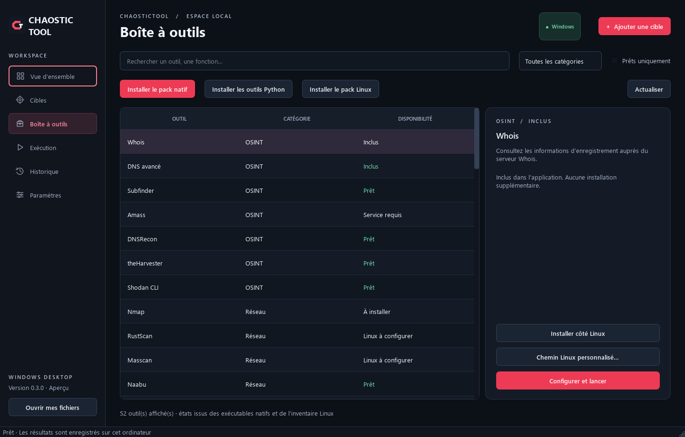
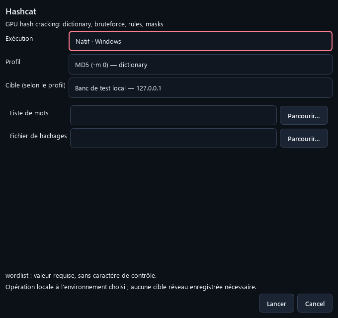

# ChaosticTool Desktop pour Windows

Une application graphique pour retrouver vos outils, configurer leurs profils et suivre leurs résultats depuis la même interface.

**[Télécharger Desktop 0.3.0](https://github.com/Chaos-Tic/Chaostic-Tool/releases/tag/desktop-v0.3.0)** · [Version Linux en terminal](README_LINUX.md) · [Guide Desktop multi-systèmes](docs/DESKTOP.md)

> Desktop 0.3.0 est une préversion. Cette page présente l'application Windows. La version Linux en terminal possède son [README dédié](README_LINUX.md).

## L'interface Windows

### Boîte à outils

Recherchez un outil, filtrez par catégorie et consultez son état avant de le lancer. Le catalogue comporte les **48 outils d'origine et 4 diagnostics supplémentaires**, soit 52 entrées.

*Capture de Desktop 0.3.0 avec plusieurs outils déjà installés. Les états et le nombre d'outils disponibles dépendent de votre ordinateur ; les 52 entrées ne sont pas toutes prêtes dès la première installation.*

### Formulaires de lancement

Choisissez le mode d'exécution et le profil, puis renseignez les fichiers ou paramètres nécessaires. Une cible réseau est demandée uniquement pour les profils qui en ont besoin.

*Exemple de formulaire pour une opération locale. Les champs changent selon l'outil et le profil sélectionnés.*

## Télécharger la bonne version

| Votre ordinateur | Fichier à télécharger |
|---|---|
| Windows 10 64 bits, version 1809 ou ultérieure, Intel ou AMD | [Installateur Windows x64](https://github.com/Chaos-Tic/Chaostic-Tool/releases/download/desktop-v0.3.0/ChaosticTool-Setup-0.3.0-windows-x64.exe) |
| Windows 11, Intel ou AMD | [Installateur Windows x64](https://github.com/Chaos-Tic/Chaostic-Tool/releases/download/desktop-v0.3.0/ChaosticTool-Setup-0.3.0-windows-x64.exe) |
| Windows 11 ARM64, notamment les PC Snapdragon | [Installateur Windows ARM64](https://github.com/Chaos-Tic/Chaostic-Tool/releases/download/desktop-v0.3.0/ChaosticTool-Setup-0.3.0-windows-arm64.exe) |

Le type de processeur se trouve dans **Paramètres → Système → Informations système**, à la ligne **Type du système**. Windows 7, Windows 8/8.1 et Windows 32 bits ne sont pas pris en charge.

Les builds Windows x64 et ARM64 sont vérifiés automatiquement. Windows 10 fait partie du périmètre visé, mais toutes ses versions et configurations matérielles n'ont pas été testées. Voir le [guide de compatibilité et les environnements de test](docs/DESKTOP.md).

## Installer et démarrer

1. Téléchargez l'installateur adapté à votre ordinateur.
2. Ouvrez le fichier `.exe` et suivez l'assistant. Un raccourci sur le bureau est proposé en option.
3. Lancez **ChaosticTool Desktop** depuis le menu Démarrer.
4. Ouvrez **Boîte à outils**, recherchez **Diagnostic local**, puis choisissez **Configurer et lancer** pour vérifier l'application sans cible réseau.

**Python et Git ne sont pas nécessaires pour lancer l'application installée.** L'installation de l'application se fait dans votre compte utilisateur. Certaines dépendances ou opérations peuvent ensuite demander des droits administrateur.

L'installateur actuel n'a pas de signature d'éditeur : les protections Windows peuvent afficher un avertissement ou bloquer son ouverture. Les empreintes SHA-256 des fichiers sont disponibles sur la page de téléchargement.

## Préparer les outils

Depuis **Boîte à outils**, utilisez les boutons **Installer le pack natif**, **Installer les outils Python**, ou sélectionnez un outil pour l'installer individuellement.

- Les fonctions intégrées sont disponibles avec l'application.
- Les outils externes sont téléchargés séparément ; une connexion Internet est nécessaire pour les installer.
- Si un Python adapté est absent, l'application peut télécharger un runtime isolé pour les outils Python.
- Les clés API, pilotes et services demandés par certains outils restent à configurer.

L'état **Prêt** indique qu'un exécutable a été détecté. Il ne garantit pas que ses services, identifiants ou prérequis matériels sont configurés. Les échecs d'installation restent visibles, notamment si un antivirus bloque un outil.

### Pour les outils nécessitant Linux

Ouvrez **Paramètres → Configurer Linux / WSL / SSH**. Sous Windows, vous pouvez utiliser :

- **WSL avec une distribution Linux**, de préférence Kali. Le bouton **Installer WSL et Kali Linux…** lance la préparation officielle ; Windows peut demander une élévation et un redémarrage. Terminez aussi l'initialisation de la distribution et de son compte utilisateur.
- **Votre propre machine Linux en SSH**, avec une connexion par clé déjà configurée.

Vérifiez ensuite la connexion et les outils depuis les paramètres. Le bouton **Installer le pack Linux** installe les paquets disponibles dans l'environnement choisi. Le détail des prérequis et des fichiers locaux/distants est dans le [guide Desktop](docs/DESKTOP.md#outils-nécessitant-linux).

WSL n'est pas requis pour l'interface et les outils natifs. Les fonctions Wi-Fi nécessitent une interface et des pilotes compatibles, réellement accessibles dans Linux.

## Utilisation au quotidien

- **Cibles** : enregistrez un domaine, une adresse IP ou une URL pour les profils réseau.
- **Boîte à outils** : choisissez un outil, son profil et ses paramètres.
- **Exécution** : suivez les sorties, saisissez les réponses des sessions interactives et arrêtez l'opération si nécessaire.
- **Historique** : retrouvez les journaux et ouvrez les dossiers de résultats.

Utilisez les outils sur les environnements pour lesquels vous disposez d'une autorisation. Desktop ne reprend pas encore les flows, Tor/proxychains et VPN guard de la CLI Linux.

## Mettre à jour ou désinstaller

Pour mettre à jour, fermez l'application et lancez le nouvel installateur. **Il n'est pas nécessaire de désinstaller la version précédente.** Vos cibles, paramètres, résultats et outils téléchargés sont conservés.

Pour désinstaller, ouvrez **Paramètres Windows → Applications**, sélectionnez **ChaosticTool Desktop**, puis **Désinstaller**.

Les données personnelles restent dans `%LOCALAPPDATA%\ChaosticTool\Desktop` après la désinstallation. Vous pouvez ouvrir ce dossier depuis les paramètres de l'application.

## Documentation et code

- [Guide Desktop complet](docs/DESKTOP.md) : prérequis, données, Linux/WSL/SSH et compilation.
- [Catalogue et profils disponibles](docs/WINDOWS_PORT.md).
- [Téléchargements publics](https://github.com/Chaos-Tic/Chaostic-Tool/releases).
- [Version Linux en terminal](README_LINUX.md).

Les captures de cette page correspondent à **Desktop 0.3.0** et doivent être renouvelées lorsque l'interface change.
