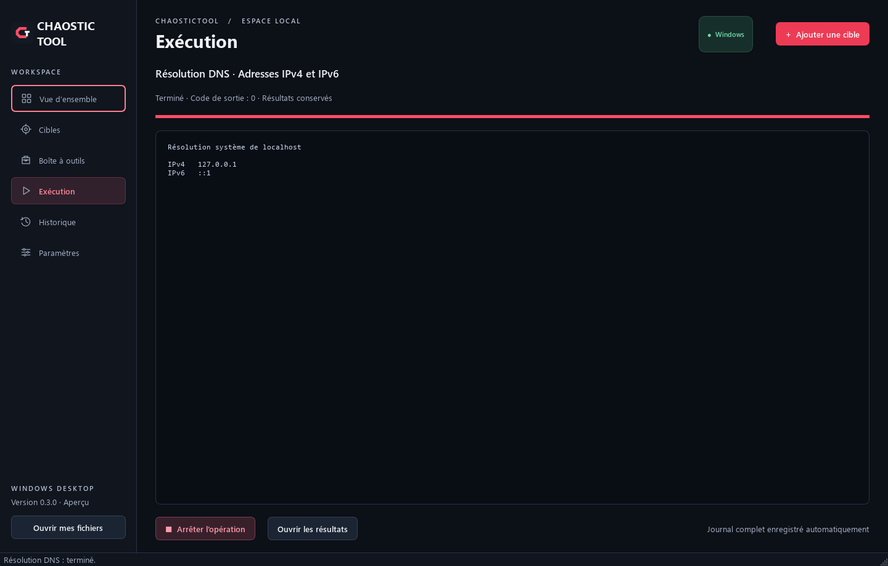
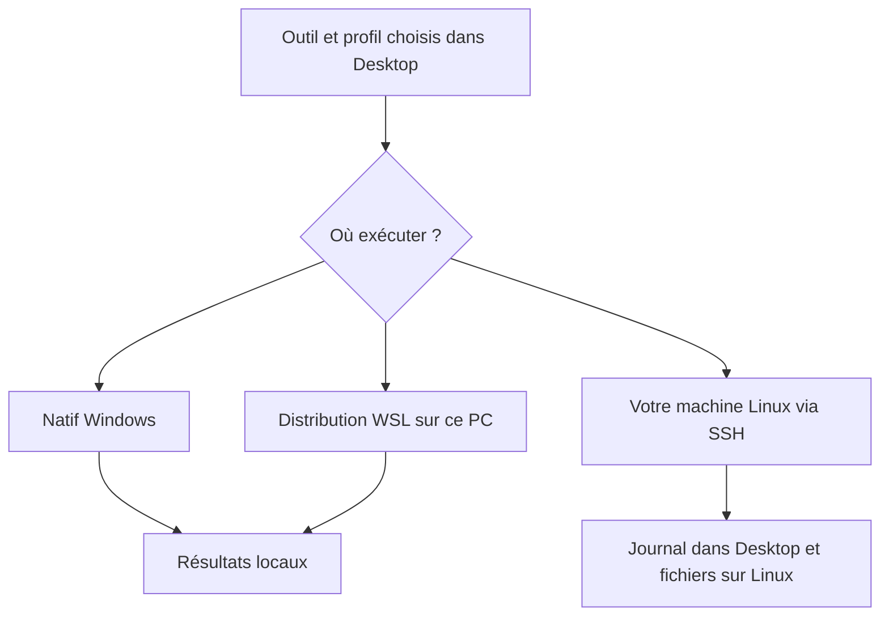
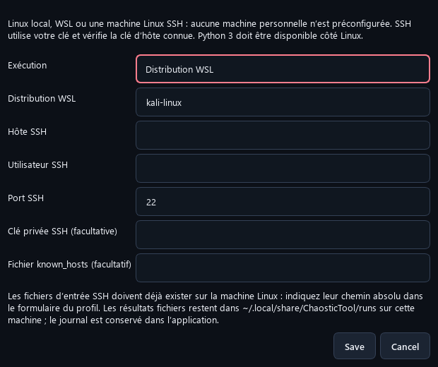

<div align="center">

# ChaosticTool Desktop · Windows

### Vos outils. Vos cibles. Vos résultats, dans une interface graphique.

**Windows 10 / 11 · x64 et ARM64 · Préversion 0.3.0**

**[Télécharger pour Intel / AMD](https://github.com/Chaos-Tic/Chaostic-Tool/releases/download/desktop-v0.3.0/ChaosticTool-Setup-0.3.0-windows-x64.exe)** · **[Télécharger pour Windows ARM64](https://github.com/Chaos-Tic/Chaostic-Tool/releases/download/desktop-v0.3.0/ChaosticTool-Setup-0.3.0-windows-arm64.exe)**

[Tous les téléchargements et empreintes](https://github.com/Chaos-Tic/Chaostic-Tool/releases/tag/desktop-v0.3.0) · [Linux CLI](README_LINUX.md) · [Linux / macOS Desktop](docs/DESKTOP.md)

</div>

ChaosticTool Desktop rassemble un catalogue d'outils, des formulaires de lancement, une vue d'exécution et un historique local. Vous choisissez une cible lorsque le profil en demande une, configurez l'opération et retrouvez son journal dans l'application.


*Cette capture montre un profil de démonstration après une résolution de `localhost`. Les six fonctions intégrées sont disponibles dans ce profil ; les autres outils n'y ont pas été installés. Les captures de ce guide proviennent de Desktop 0.3.0, sans maquette ni résultats simulés.*

> **À savoir avant de commencer**
>
> Le catalogue contient **48 outils d'origine et 4 diagnostics supplémentaires**, soit **52 entrées**. Une entrée au catalogue n'est pas une dépendance déjà installée. Certaines opérations nécessitent Linux, des droits particuliers, une clé API, un service ou du matériel adapté. L'application installée ne demande ni Python ni Git pour démarrer.

## Dans ce guide

- [1. Choisir son installation](#installation)
- [2. Réussir sa première opération](#premiere-operation)
- [3. Comprendre les écrans et les états](#interface)
- [4. Installer et configurer les outils](#outils)
- [5. Choisir entre Windows, WSL et SSH](#environnements)
- [6. Retrouver et sauvegarder ses données](#donnees)
- [7. Mettre à jour ou désinstaller](#maintenance)
- [8. Résoudre un problème](#depannage)
- [9. Compatibilité, tests et limites](#validation)
- [10. Développement et références](#references)

<a id="installation"></a>
## 1. Choisir son installation

### Quel fichier télécharger ?

| Votre ordinateur | Fichier de la version 0.3.0 | Périmètre Windows |
|---|---|---|
| Intel ou AMD 64 bits | `ChaosticTool-Setup-0.3.0-windows-x64.exe` | Windows 10 version 1809+ ou Windows 11 |
| ARM64, par exemple un PC Snapdragon | `ChaosticTool-Setup-0.3.0-windows-arm64.exe` | Windows 11 ARM64 |
| Windows 32 bits, Windows 7 ou Windows 8/8.1 | Aucun paquet compatible | Non pris en charge |

Dans **Paramètres Windows → Système → Informations système**, consultez **Type du système**. Pour connaître la version de Windows 10, ouvrez `winver` depuis le menu Démarrer. La disponibilité d'une archive ARM64 pour l'application ne garantit pas que chaque outil tiers dispose lui aussi d'un binaire ARM64.

**Application et WSL ont des prérequis distincts.** L'installateur de l'application déclare Windows 10 1809 comme minimum. La procédure WSL utilisée par son bouton de préparation demande Windows 10 **2004 / build 19041 ou ultérieur**, ou Windows 11. Les outils natifs n'ont pas besoin de WSL. [Exigences Microsoft pour cette procédure WSL](https://learn.microsoft.com/en-us/windows/wsl/install).

### De quoi avez-vous besoin ?

| Élément | Pour l'application | Pour certains outils |
|---|---|---|
| Python ou Git préinstallé | Non | Un Python isolé peut être téléchargé automatiquement pour le pack Python |
| Connexion Internet | Pour télécharger l'installateur ; pas pour le diagnostic local | Pour installer les dépendances et utiliser les services en ligne |
| Droits administrateur Windows | Pas pour l'installation par utilisateur | Possibles pour WSL, des pilotes ou certaines opérations |
| Virtualisation | Non | Nécessaire à WSL 2 ; doit être disponible et activée sur le PC |
| GPU / carte Wi-Fi spécialisée | Non | Selon le profil et l'outil ; leurs pilotes restent à préparer |
| Espace disque et mémoire | Aucun minimum RAM/disque n'a été certifié pour toutes les configurations | Variable, notamment avec les packs et une distribution Linux |

Les installateurs 0.3.0 pèsent environ **35 Mo en x64** et **26 Mo en ARM64**. Ce sont les tailles des téléchargements, pas l'espace total après installation des outils ou de Linux.

### Installation pas à pas

1. Sur la [Release Desktop 0.3.0](https://github.com/Chaos-Tic/Chaostic-Tool/releases/tag/desktop-v0.3.0), téléchargez l'installateur de votre architecture. Les fichiers « Source code » s'adressent au développement et ne sont pas l'installateur.
2. Ouvrez le fichier `.exe`, choisissez la langue de l'assistant et suivez ses étapes.
3. Conservez le dossier proposé, sauf besoin particulier : `%LOCALAPPDATA%\Programs\ChaosticTool`.
4. Cochez le raccourci sur le bureau si vous le souhaitez. Le menu Démarrer propose aussi **ChaosticTool Desktop**.
5. Lancez l'application, puis effectuez le diagnostic décrit ci-dessous.

La préversion n'a pas de signature d'éditeur Windows. SmartScreen ou une politique d'entreprise peut donc afficher un avertissement ou empêcher l'ouverture. Vérifiez la provenance du fichier ; le guide ne demande pas de désactiver vos protections.

<details>
<summary>Vérifier l'empreinte du téléchargement — facultatif, avec PowerShell</summary>

Téléchargez le fichier `.sha256` correspondant depuis la même Release. Dans PowerShell, adaptez le chemin de votre téléchargement :

```powershell
Get-FileHash -Algorithm SHA256 -LiteralPath "$env:USERPROFILE\Downloads\ChaosticTool-Setup-0.3.0-windows-x64.exe"
```

Comparez les 64 caractères hexadécimaux obtenus au contenu du fichier `.sha256`. La comparaison vérifie que le téléchargement correspond au fichier publié ; elle ne remplace pas une signature d'éditeur. Vous n'avez pas besoin de cette commande pour utiliser l'interface.

</details>

<a id="premiere-operation"></a>
## 2. Réussir sa première opération

### Étape A — vérifier l'application sans cible

Dans **Vue d'ensemble**, cliquez sur **Diagnostic local**. Vous pouvez aussi le rechercher dans **Boîte à outils**, puis choisir **Configurer et lancer**.

**Résultat attendu :** l'écran **Exécution** affiche la version, le système et « Moteur de diagnostic opérationnel ». L'état passe à **Terminé**, avec le code de sortie `0`. Ce diagnostic ne contacte aucun serveur et ne nécessite pas d'installer un outil externe.

### Étape B — enregistrer une cible de démonstration

1. Cliquez sur **Ajouter une cible**.
2. Saisissez l'adresse `http://localhost` et le nom **Démo locale**, puis enregistrez.
3. Dans **Boîte à outils**, recherchez **Résolution DNS**.
4. Cliquez sur **Configurer et lancer**, choisissez **Adresses IPv4 et IPv6**, puis sélectionnez **Démo locale**.
5. Cliquez sur **Lancer**.

**Résultat attendu :** une adresse de boucle locale, généralement `127.0.0.1` et/ou `::1`, apparaît dans **Exécution**. Il n'est pas nécessaire d'avoir un serveur web en fonctionnement : ce profil résout le nom `localhost` et ne fait pas de requête HTTP.



*La capture montre le résultat réellement obtenu pour le parcours ci-dessus. L'IPv6 peut ne pas apparaître sur toutes les configurations.*

### Étape C — retrouver le résultat

Cliquez sur **Ouvrir les résultats**, ou passez par **Historique**, sélectionnez l'opération puis ouvrez son dossier ou exportez le journal. Vous retrouvez l'état final et le texte produit même après avoir fermé l'application.

Ce parcours confirme le lancement, le traitement d'une cible et la conservation d'un résultat. Il ne valide pas encore WSL ni les dépendances externes.

<a id="interface"></a>
## 3. Comprendre les écrans et les états

| Écran | À quoi il sert | Ce qu'il faut regarder |
|---|---|---|
| **Vue d'ensemble** | Reprendre le travail et lancer le diagnostic | Cible active, outils détectés, opérations récentes |
| **Cibles** | Enregistrer et sélectionner un domaine, une IP ou une URL | La cible choisie pour votre prochaine opération |
| **Boîte à outils** | Chercher, installer et configurer un outil | État de disponibilité, profils et prérequis |
| **Exécution** | Suivre l'opération courante et interagir lorsqu'un profil le prévoit | Journal, code de sortie, boutons d'arrêt et de résultats |
| **Historique** | Relire ou exporter une opération précédente | État final et dossier de résultats |
| **Paramètres** | Configurer Linux, les chemins et accéder aux données | Environnement choisi et dernier inventaire des outils |


*Cette capture utilise un autre profil de démonstration où plusieurs outils ont déjà été installés. Elle illustre les états possibles, pas la configuration initiale d'un nouveau poste.*

### Que signifient les états des outils ?

| État | Signification | Suite logique |
|---|---|---|
| **Inclus** | Moteur fourni avec l'application | Ouvrir le formulaire et renseigner les paramètres nécessaires |
| **Prêt** | Exécutable natif détecté | Vérifier les éventuelles clés API, pilotes ou services avant usage |
| **Prêt · Linux** | Outil trouvé dans le dernier inventaire Linux | Choisir l'environnement Linux dans le formulaire |
| **À installer** | Programme natif non détecté | Installer l'outil ou sélectionner son exécutable compatible |
| **Linux à configurer** | Aucun inventaire Linux exploitable pour cet outil | Configurer WSL/SSH puis vérifier la connexion |
| **À installer · Linux** | Environnement détecté, mais outil absent de son inventaire | Installer le paquet côté Linux puis relancer la détection |
| **Service requis** | L'outil demande aussi un moteur tiers, notamment Amass | Configurer le service et renseigner son adresse dans le profil |
| **Échec installation** | Une tentative a échoué | Lire le journal : réseau, archive, dépendance, antivirus… |

**Le compteur « Outils prêts » n'est pas le nombre total du catalogue.** Il évolue selon les exécutables et l'inventaire Linux. Une clé API valide, les capacités d'un GPU ou le mode moniteur d'une carte Wi-Fi ne sont pas vérifiés par ce compteur.

### Pendant une opération

Desktop exécute une opération à la fois. Pour les sessions interactives, utilisez le champ de saisie et **Envoyer** ; **Masquer** cache la saisie et demande son masquage si l'outil la réaffiche. **Ctrl+C** envoie une interruption à la session Linux. **Arrêter l'opération** déclenche l'arrêt supervisé et conserve le journal partiel.

| État final | Interprétation |
|---|---|
| **Terminé** | Le processus a renvoyé un succès ; lire le résultat pour en interpréter le contenu |
| **Échec** | Lancement impossible, erreur de l'outil ou délai dépassé ; consulter le détail et le code de sortie |
| **Arrêté** | Arrêt demandé depuis l'application |
| **Interrompu** | Une opération enregistrée était encore en cours lors d'une fermeture précédente |

La sortie visible peut être limitée pour préserver la réactivité. Le journal complet se consulte dans le dossier ou par export. Les opérations ont des délais maximaux : environ 30 secondes pour les diagnostics intégrés, 20 minutes pour un outil standard, 30 minutes pour les installations natives/WSL et une heure pour le pack Linux. Ces limites sont celles de la version 0.3.0.

<a id="outils"></a>
## 4. Installer et configurer les outils

### Choisir le bon bouton

| Action dans **Boîte à outils** | Contenu / effet |
|---|---|
| **Installer le pack natif** | Subfinder, httpx de ProjectDiscovery, ffuf, Gobuster, Nuclei, Katana, gau, waybackurls, Dalfox et Naabu, selon les archives disponibles pour votre architecture |
| **Installer les outils Python** | wafw00f, DNSRecon, theHarvester, Shodan, XSStrike, BloodHound Python, Impacket et sqlmap |
| **Installer cet outil** | Installation individuelle lorsqu'un paquet natif est géré ; certaines fiches proposent d'autres outils comme Hashcat |
| **Configurer le programme** / sélection de l'exécutable | Utilisation d'un programme déjà installé et compatible avec ce PC |
| **Installer côté Linux** | Installation de l'outil sélectionné dans l'environnement Linux configuré |
| **Installer le pack Linux** | Installation des paquets du catalogue disponibles dans les dépôts de cet environnement |

Les archives sont choisies selon l'OS et l'architecture et contrôlées par SHA-256 avant extraction. Les outils Python disposent de leurs environnements isolés ; un runtime Python adapté peut être téléchargé automatiquement. Les versions principales sont référencées dans le [manifeste des outils](desktop/packages.json), le runtime dans [son manifeste](desktop/runtimes.json). Toutes les dépendances indirectes PyPI ne sont pas figées.

Une installation de pack peut être **partiellement réussie** : les outils installés restent disponibles, même si d'autres échouent. Le journal nomme les échecs. Nmap et certains programmes demandent une installation externe ou Linux ; la présence d'une fiche n'implique pas un installateur Windows automatisé pour chaque architecture.

### Remplir un profil


1. Choisissez **Exécution** : natif Windows ou environnement Linux configuré, lorsque ces choix existent.
2. Choisissez le **Profil**. Ses champs et ses besoins peuvent changer.
3. Sélectionnez une **Cible** seulement si le profil en demande une. Un profil de traitement de fichiers peut être local et ne pas utiliser la cible active.
4. Sélectionnez vos fichiers avec **Parcourir…**, ou renseignez les paramètres indiqués.
5. Lisez l'aperçu et les messages sous le formulaire, puis lancez.

Dans l'exemple Hashcat, le profil demande une liste de mots et un fichier de hachages ; un GPU et ses pilotes peuvent être nécessaires selon l'utilisation. L'exemple illustre les champs, sans fournir ni exécuter de traitement sur des données tierces.

Les champs sensibles prévus par les profils — mot de passe, cookie, clé API — sont masqués dans l'aperçu, l'historique de commande et le flux géré par Desktop. **Les fichiers produits et les configurations propres aux outils restent sous leur responsabilité** : ils peuvent conserver des informations sensibles. Par exemple, initialiser Shodan configure sa clé pour ses usages suivants.

<a id="environnements"></a>
## 5. Choisir entre Windows, WSL et SSH



| Mode | À préparer | Où sont les fichiers d'entrée et de sortie ? |
|---|---|---|
| **Natif Windows** | Programme Windows compatible et ses éventuels prérequis | Sur le PC ; sorties du profil dans son dossier d'opération |
| **WSL** | WSL, distribution initialisée, Python 3 et outils Linux | Fichiers Windows accessibles dans WSL ; chemins traduits par l'application |
| **SSH** | Votre Linux, Python 3, OpenSSH côté Windows, clé autorisée et hôte connu | Entrées déjà présentes sur Linux ; sorties sur Linux ; journal conservé dans Desktop |

Le réseau utilisé est celui de l'environnement d'exécution. Une cible `127.0.0.1` désigne donc le PC en natif, l'environnement Linux en WSL ou la machine distante en SSH selon le mode choisi. Vérifiez ce choix avant d'interpréter un résultat.

### Préparer WSL et Kali

1. Dans **Paramètres**, cliquez sur **Installer WSL et Kali Linux…**. Une demande de droits administrateur peut apparaître.
2. Lisez la sortie d'installation. Si Windows demande un redémarrage, redémarrez manuellement, puis reprenez la préparation si la distribution n'est pas encore installée.
3. Ouvrez **Kali Linux** depuis Démarrer et terminez la création du compte Linux. Cette initialisation peut ouvrir une console et demander un nom d'utilisateur et un mot de passe ; elle n'est pas remplacée par le formulaire Desktop. [Procédure officielle Kali](https://www.kali.org/docs/wsl/wsl-preparations/).
4. Revenez à **Paramètres → Configurer Linux / WSL / SSH**, choisissez **Distribution WSL** et renseignez son nom, généralement `kali-linux`.
5. Enregistrez. La connexion est vérifiée ; vous pouvez relancer **Vérifier la connexion et les outils**.
6. Installez un outil côté Linux ou le pack Linux, puis vérifiez son état dans le catalogue.



*Les champs SSH restent désactivés en mode WSL. La capture ne représente pas une connexion déjà validée : l'inventaire s'effectue après l'enregistrement.*

Le pack Linux utilise `apt` sur Kali/Debian/Ubuntu. Il n'ajoute pas de dépôts Kali à Ubuntu. Un paquet absent est signalé ; le catalogue ne peut pas garantir la présence de tous les outils dans les dépôts de toutes les distributions. Si un programme est déjà installé ailleurs, utilisez **Chemin Linux personnalisé…**, puis relancez l'inventaire.

<details>
<summary>Vérifications WSL facultatives dans PowerShell</summary>

Ces commandes consultent l'état de WSL ; elles ne suppriment aucune distribution :

```powershell
wsl --version
wsl --list --verbose
```

Recopiez le nom de distribution réellement affiché dans les paramètres de Desktop. Le compte et le mot de passe Linux sont distincts du compte Windows. Voir [la préparation du compte Linux chez Microsoft](https://learn.microsoft.com/en-us/windows/wsl/setup/environment).

</details>

### Utiliser votre machine Linux en SSH

Choisissez **Machine ou VM Linux en SSH**, renseignez l'hôte, l'utilisateur et le port, puis, si nécessaire, le chemin de votre clé privée et celui du fichier `known_hosts`. Enregistrez et vérifiez la connexion.

Le mode 0.3 utilise une authentification SSH par clé déjà fonctionnelle et refuse les clés d'hôte inconnues. Il ne fournit pas d'assistant de création de clé, d'acceptation initiale de l'hôte ou de saisie de mot de passe SSH. Une clé chiffrée doit pouvoir être utilisée sans demande interactive par le client SSH, par exemple via votre agent déjà préparé.

En SSH, les champs de fichiers attendent des **chemins Linux absolus**, comme `/home/demo/documents/liste.txt`, et non `C:\…`. Il n'y a pas de transfert automatique. Les fichiers de sortie se trouvent sous `~/.local/share/ChaosticTool/runs/` sur Linux ; le journal textuel de la session est enregistré côté Desktop.

<a id="donnees"></a>
## 6. Retrouver et sauvegarder ses données

| Emplacement Windows par défaut | Contenu |
|---|---|
| `%LOCALAPPDATA%\Programs\ChaosticTool` | Application installée et bibliothèques |
| `%LOCALAPPDATA%\ChaosticTool\Desktop` | Données de votre compte utilisateur |
| `settings.json` dans le dossier de données | Cibles, sélection active et chemins configurés |
| `linux.json` / `linux-status.json` | Configuration Linux et dernier inventaire |
| `tools\` | Outils téléchargés, manifestes et informations d'échec |
| `runs\<opération>\run.json` | Métadonnées : outil, profil, dates, commande masquée et état |
| `runs\<opération>\output.txt` | Journal textuel de l'opération |

Dans **Paramètres**, utilisez **Ouvrir le dossier de données** pour retrouver le bon emplacement. Une variable `CHAOSTIC_DESKTOP_HOME` peut modifier ce dossier dans une configuration avancée.

Pour sauvegarder : fermez Desktop, puis copiez le dossier de données vers votre stockage de sauvegarde. Les journaux et les fichiers de résultats peuvent contenir des informations sur vos cibles ; traitez-les comme vos autres données de travail.

Une copie du dossier ne garantit pas une migration immédiate des dépendances vers un autre PC : certains environnements Python et chemins configurés dépendent de leur emplacement. Sur une nouvelle machine, restaurez vos données utiles et réinstallez/reconfigurez les outils si nécessaire.

<a id="maintenance"></a>
## 7. Mettre à jour ou désinstaller

**Mise à jour :** fermez Desktop, téléchargez l'installateur de la nouvelle version pour votre architecture et lancez-le. Il n'est pas nécessaire de désinstaller la version précédente. Les données restent dans leur dossier séparé. La version 0.3 ne comporte pas de mise à jour automatique de l'application.

**Désinstallation :** ouvrez **Paramètres Windows → Applications**, sélectionnez **ChaosticTool Desktop**, puis **Désinstaller**. L'application et ses raccourcis sont retirés. Les cibles, journaux et outils téléchargés dans le dossier de données sont conservés.

**Nettoyage complet :** après sauvegarde et désinstallation, vous pouvez supprimer vous-même `%LOCALAPPDATA%\ChaosticTool\Desktop` si vous souhaitez aussi effacer ces données et dépendances. Une distribution WSL, un programme installé séparément ou les fichiers d'une machine SSH ne sont pas supprimés par le désinstalleur Desktop.

<a id="depannage"></a>
## 8. Résoudre un problème

| Symptôme | À vérifier | Action utile |
|---|---|---|
| L'installateur ne correspond pas à ce PC | Architecture x64/ARM64 et version Windows | Reprendre le tableau de téléchargement ; ne pas utiliser une archive Linux/macOS |
| Windows bloque l'ouverture | Provenance, avertissement de réputation ou politique administrateur | Vérifier la Release et son empreinte ; consulter le message exact. Ne pas désactiver globalement les protections |
| Seulement 6 outils sont prêts | Profil neuf sans dépendances externes | C'est cohérent avec les six fonctions intégrées ; installer les outils souhaités |
| Le catalogue n'affiche pas les 52 entrées | Recherche, catégorie et **Prêts uniquement** | Effacer la recherche, choisir toutes les catégories et désactiver ce filtre |
| Un pack se termine en échec | Liste des outils qui ont réellement échoué | Lire **Historique** ; les installations déjà réussies sont conservées |
| Un antivirus bloque un outil | Historique de protection Windows et journal de l'installation | Identifier le paquet concerné ; Desktop ne crée pas d'exclusion antivirus |
| « Linux à configurer » | Mode WSL/SSH et dernière vérification | Enregistrer la configuration puis vérifier la connexion |
| WSL demande un redémarrage | Fonctionnalités Windows activées mais non effectives | Redémarrer, terminer l'initialisation de Kali, puis reprendre la vérification |
| SSH échoue | Client SSH, hôte, port, utilisateur, clé et `known_hosts` | Rétablir la connexion par clé ; les mots de passe interactifs SSH ne sont pas pris en charge ici |
| Un fichier est introuvable en SSH | Chemin saisi et emplacement réel | Utiliser son chemin absolu sur Linux ; aucun envoi automatique du fichier local |
| HTTP renvoie « connexion refusée » | Service web et port de la cible | Vérifier que votre service écoute ; enregistrer l'URL avec son port, par exemple `http://localhost:8080` |
| Amass indique « Service requis » | Moteur de collecte configuré | Préparer le moteur puis renseigner son URL dans le formulaire |
| Hashcat démarre mais ne trouve pas de périphérique | GPU / environnement de calcul et pilotes | Consulter la documentation du constructeur et de Hashcat ; le lancement du binaire ne valide pas le GPU |
| Un outil Wi-Fi ne voit pas d'interface compatible | Matériel réellement accessible depuis Linux | Vérifier interface, pilotes et capacités Linux ; la présence d'une carte Wi-Fi Windows ne suffit pas |
| L'opération dépasse sa durée maximale | Profil, taille des données et délai affiché | Consulter le journal partiel et les limites de durée de cette version |
| Le journal affiché est incomplet | Aperçu limité par l'interface | **Exporter le journal…** ou ouvrir `output.txt` dans le dossier d'opération |

### Signaler un bug utilement

Dans une [issue GitHub](https://github.com/Chaos-Tic/Chaostic-Tool/issues), indiquez : version Desktop, version/build Windows, architecture, outil et profil, mode natif/WSL/SSH, étapes de reproduction, résultat attendu, message exact et code de sortie. Ajoutez seulement un extrait pertinent du journal, après retrait des secrets et informations privées.

<a id="validation"></a>
## 9. Compatibilité, tests et limites

La [compilation du tag Desktop 0.3.0](https://github.com/Chaos-Tic/Chaostic-Tool/actions/runs/36353394893) a réussi pour Windows, Linux et macOS en x64/ARM64. Les sources de cette version sont identifiées par le tag `desktop-v0.3.0` et le commit `cfc209e4ce839bb09b8ec0d963e687d950d54a67`.

| Vérification | Portée réelle |
|---|---|
| 34 tests automatisés | Formulaires, arguments, persistance, erreurs, arrêt, masquage des secrets et pont POSIX ; 5 tests POSIX sont ignorés sous Windows |
| Exécutables des 6 plateformes | Lancement de l'application compilée avec un profil temporaire |
| Windows x64 / ARM64 en CI | Runners Windows Server 2022 et Windows 11 ARM ; cela ne teste pas chaque version de Windows 10 |
| Installation Windows locale | Installation, réinstallation, inscription du désinstalleur et conservation des données dans un environnement de test distinct |
| Python automatique | Téléchargement et lancement d'un runtime isolé sous Windows en simulant l'absence de Python installé |
| DNS avancé compilé | Réponse vérifiée contre un serveur DNS local de test |
| Pont Linux/macOS | Inventaire et pseudo-terminal réel, y compris dans les exécutables compilés |

**Ce qui n'est pas promis par la préversion :** toutes les opérations de tous les outils testées sur des cibles réelles ; tous les GPU ou périphériques Wi-Fi ; une distribution native de chaque dépendance sur ARM64 ; une configuration automatique de vos services et clés API ; une signature d'éditeur Windows ; un transfert de fichiers SSH ; la reprise après interruption d'une opération ; des opérations simultanées ; les flows et fonctions Tor/proxychains/VPN guard de la CLI.

Le détail des profils par outil se trouve dans le [catalogue de compatibilité](docs/WINDOWS_PORT.md). Utilisez ces fonctions sur vos propres environnements ou dans le cadre d'une autorisation explicite.

<a id="references"></a>
## 10. Développement et références

<details>
<summary>Construire l'application Windows depuis les sources</summary>

Pour le développement uniquement, préparez Python 3.14 et Inno Setup 6, puis utilisez un environnement Python dédié :

```powershell
python -m venv .venv
.\.venv\Scripts\python.exe -m pip install -r requirements-build.txt
.\.venv\Scripts\python.exe scripts/build-desktop.py --iscc "C:\chemin\vers\ISCC.exe"
.\.venv\Scripts\python.exe scripts/smoke-desktop.py
```

Remplacez le chemin du compilateur par son emplacement réel. Le script de build lance les tests, produit l'application dans `dist/ChaosticTool/`, puis l'installateur et son empreinte dans `release/`. Un build est produit sur son architecture cible. Les dépendances de construction sont listées dans [requirements-build.txt](requirements-build.txt).

</details>

| Référence | Ce qu'elle documente |
|---|---|
| [Guide Desktop multi-systèmes](docs/DESKTOP.md) | Windows, Linux, macOS et stockage |
| [Manifeste des outils](desktop/packages.json) | Versions et distributions des dépendances gérées |
| [Manifeste Python](desktop/runtimes.json) | Runtimes isolés et empreintes |
| [Workflow de compilation](.github/workflows/desktop.yml) | Plateformes et étapes réellement exécutées |
| [Licences et composants](docs/THIRD_PARTY.md) | Dépendances et notices de redistribution |
| [Microsoft : installer WSL](https://learn.microsoft.com/en-us/windows/wsl/install) | Préparation et exigences de Windows |
| [Kali : préparation WSL](https://www.kali.org/docs/wsl/wsl-preparations/) | Installation de la distribution et premier lancement |
| [Règles du dépôt](docs/REPOSITORY_RULES.md) | Contributions et protection de `main` |

**Guide revu le 28 septembre 2026 pour Desktop 0.3.0.** Les captures doivent être renouvelées lorsque l'interface change ; les tailles, limitations et étapes ci-dessus décrivent cette version.
